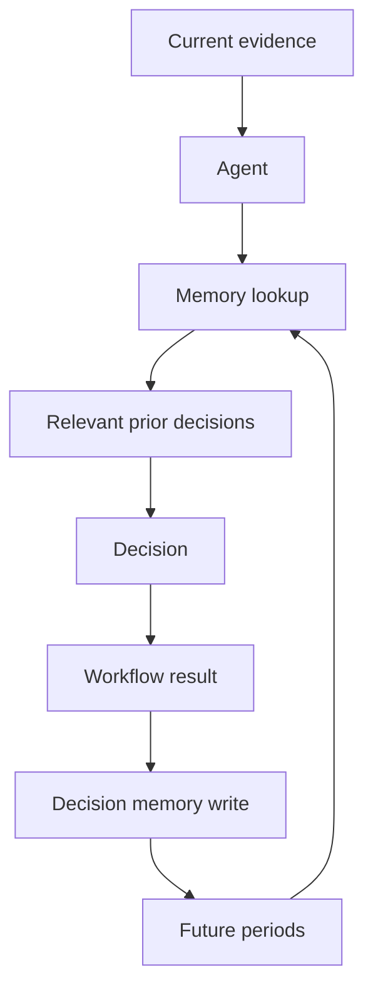

# Organizational memory

Cross-period memory lets a finance decision made in one accounting period influence a later period without becoming a binding rule.

The system remembers, for reusable cases:

1. what situation occurred
2. what evidence was available
3. what decision was made
4. why that decision was made (short auditor-facing rationale)
5. what accounting treatment or operational action resulted
6. what happened afterward
7. what part of the case is reusable as precedent

It does **not** store unconstrained chain-of-thought.

## Where memories are stored

JSON array at `runs/memory/decisions.json`.

Eval and tests redirect the store with `memory.store.configure_paths`. There is no external database.

Existing AP `prior_cases.json` and AR `ARPrecedent` records stay in place. This layer is the canonical write/read path for new cross-period decisions.

## Which workflows write memories

Writes happen only after a real completed decision, and only when the case is reusable:

| Workflow | What is written |
| --- | --- |
| Cash reconciliation | Stripe/Adyen payout differences explained by processor fees, chargebacks, or refunds |
| Prepaid / month-end close | Vendor amortization method after reviewer approval |
| Accounts payable | Exception treatments such as vendor-invoice patterns — not clean three-way matches |

Exact matches and unresolved exceptions are not stored.

## Which workflows read memories

| Workflow | When |
| --- | --- |
| Cash reconciliation | Before investigating a payout difference or fee-netted Stripe case |
| Prepaid | Before preparing a prepaid treatment |
| Accounts payable | Before exception investigation |

Agents that receive the `prior-period-precedent` skill can also call `get_decision_memories`.

## How retrieval works

Structured matching first:

- workflow
- entity type / entity id (vendor, Stripe, …)
- situation type
- tags
- accounting category
- prior period only (`prior_to_period` / `exclude_period`)

Entity-specific hits rank above unrelated records. Semantic search is not used.

The current agent must compare prior evidence to current evidence:

> Use prior decisions as precedent, not as authoritative truth. Confirm that the current evidence supports the same treatment.

## How idempotency works

Each record has `idempotency_key = sha256(workflow|entity|situation|period|fingerprint)`.

Writing the same decision twice returns the existing record. Rerunning August does not create a duplicate. September is a new period, so it becomes a new memory.

## August → September Stripe demo

```bash
python main.py memory-demo --story stripe
```

August: Stripe gross receipts $10,000, bank deposit $9,620, difference $380 = $300 fees + $80 chargeback.

September: gross $15,000, bank $14,460, difference $540 = $390 fees + $100 chargeback + $50 refund.

The September trace includes `memory_lookup` with the August `decision_id`, `precedent_used`, and whether current evidence was checked.

Prepaid companion:

```bash
python main.py memory-demo --story prepaid
```

## Memory ON vs OFF eval

```bash
python main.py eval-memory
```

Writes `runs/memory_eval/MEM-*/eval.json` and `summary.md`.

Both modes use the same Python accounting logic. Memory ON is scored on retrieval, investigation steps, and treatment consistency — not by forcing Memory OFF to be wrong.

Latest local run (12 cases):

```text
Memory OFF: 12/12 correct, 0 inconsistent treatments, 54 investigation steps, 0 precedent uses
Memory ON:  12/12 correct, 0 inconsistent treatments, 14 investigation steps, 6 precedent uses
```

## Architecture



## Current limitations

- Retrieval is structured field matching, not embeddings.
- Only cash payout differences, prepaid treatments, and selected AP exceptions are written.
- Deterministic workflows apply precedent; live LLM agents also receive the skill and tool, but tests use the Python path.
- Memory does not change published policy or Python arithmetic.
- AR cash-application precedents remain in `ar/store.py`; they are not migrated into this file.
