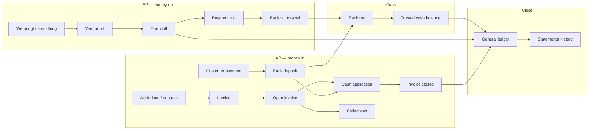
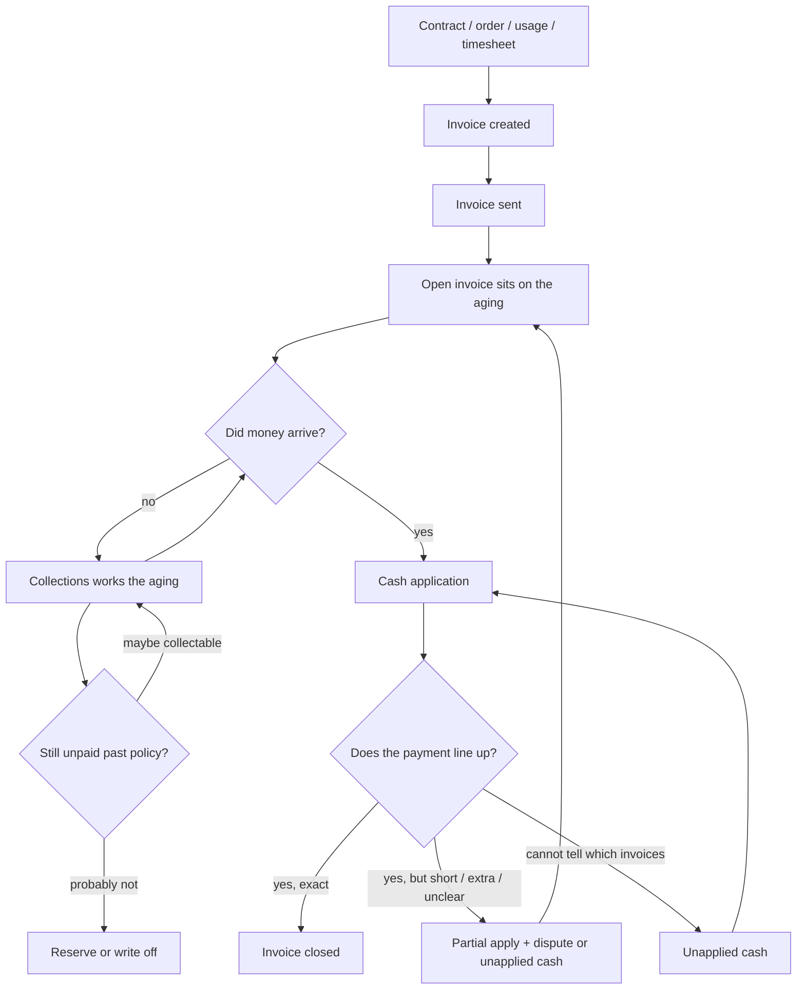
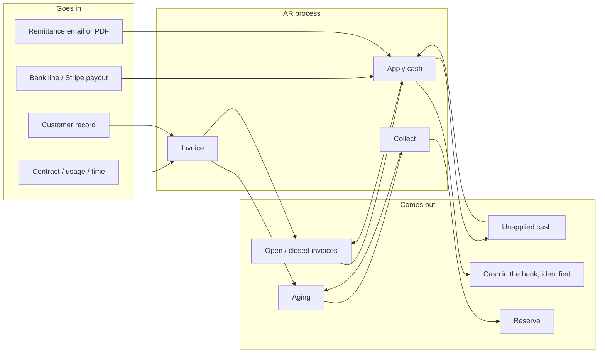
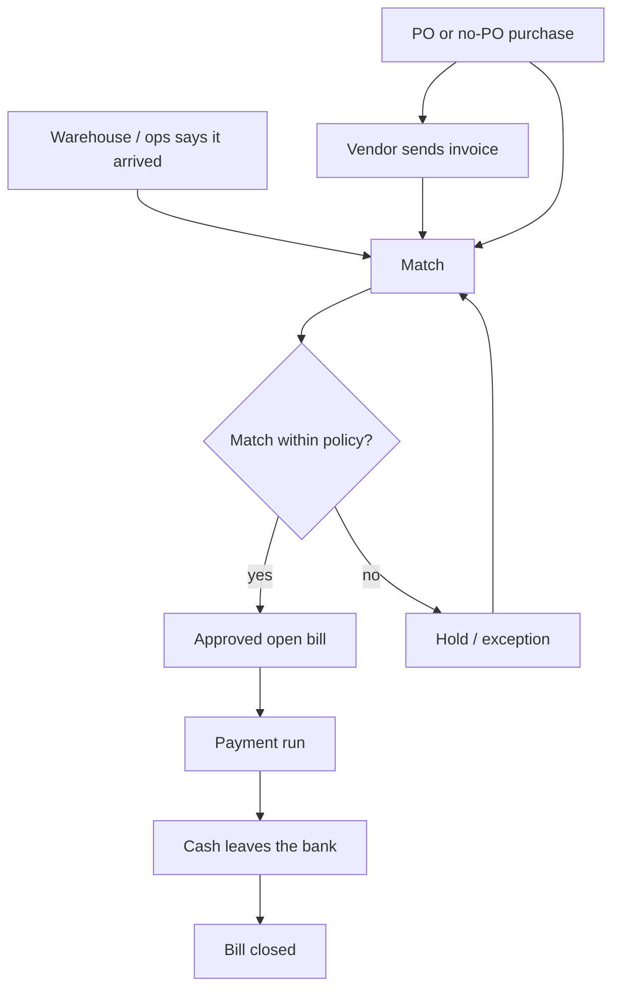
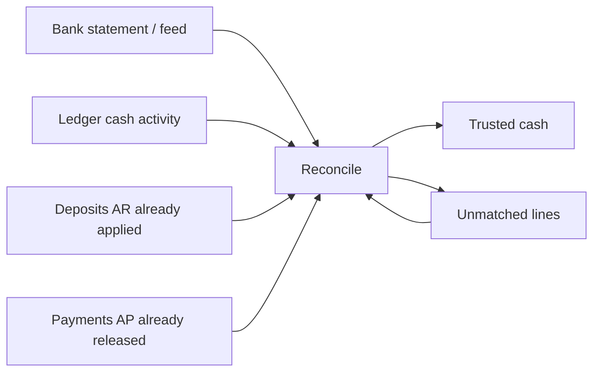
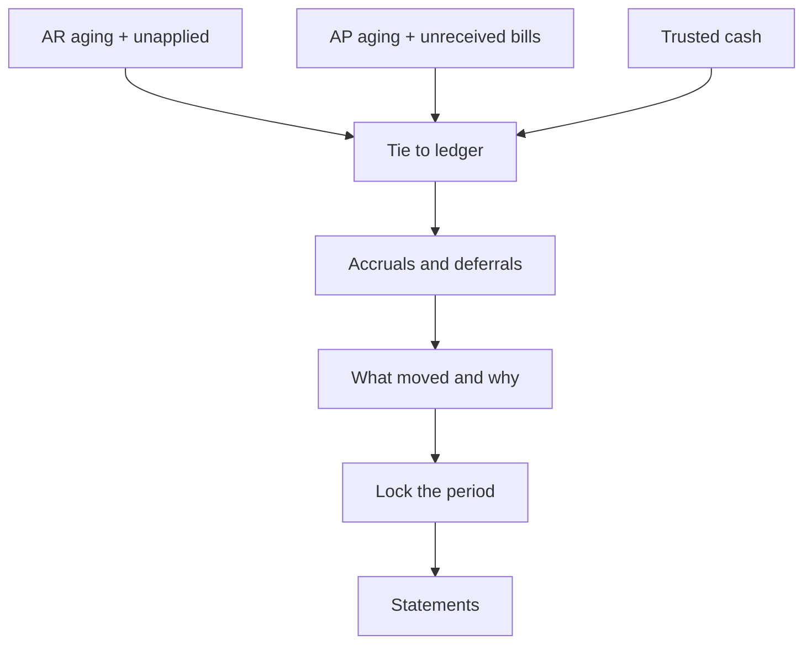
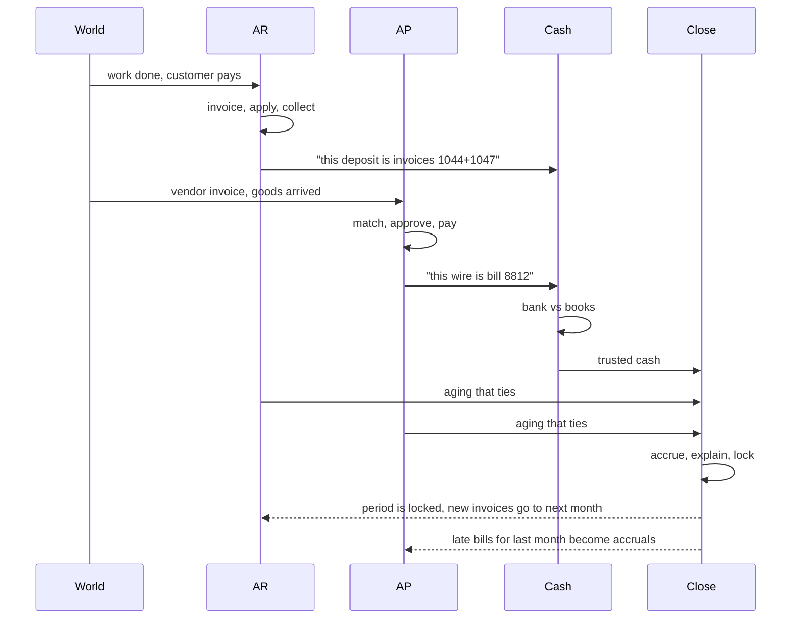
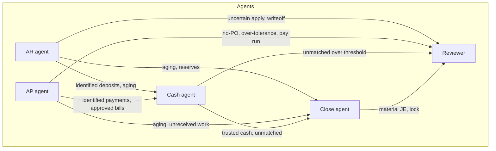

# Office of the CFO — how the work actually moves

This is a process document, not a product spec. The point is to see the pipes, the objects that travel through them, and a first cut at a small set of agents. Nothing here is frozen.

There are not fifteen features. There are four pipes and one book they all write into.

```
who owes us  →  money in   →  bank   →  the books
who we owe   →  money out  ↗
```

The books are the general ledger. Everything else is an attempt to get a real-world event into that ledger in the right period, against the right counterparty, with a piece of paper behind it.

---

## The only object that matters: an open item

Forget modules for a minute. Day to day the office is a pile of unfinished tickets.

| Open item | Means | Dies when |
|---|---|---|
| Open invoice | A customer owes us this amount | Cash is applied to it, or it is credited / written off |
| Open bill | We owe a vendor this amount | We pay it, or we dispute it down to zero |
| Unapplied cash | Money hit the bank and we have not attached it to invoices | It is applied |
| Unmatched bank line | The bank shows a movement the books do not | It is matched or a journal explains it |
| Accrual | We know the economics happened and the document has not | The invoice arrives and the accrual is reversed |

Agents should be specialists over these objects, not over "finance" in the abstract.

---

## Picture of the four pipes



AR does not dump into "reporting." It dumps into open invoices and into the bank. AP dumps into open bills and out of the bank. Cash is the fight to make the bank and the books say the same thing. Close is the fight to make the whole month internally consistent and explainable.

---

# Pipe 1 — Accounts receivable

Your mental model: find who owes us, harass them until they pay.

That is one step. It is the loud step. It is not most of the work, and it is not where the money actually gets recognized as collected.

AR is the whole path from "we earned the right to bill" to "that invoice is gone." Collections is the part where the invoice is still there and nobody has paid it.

## What AR really is

Three jobs, in order, done by the same team in a small company and by different people in a bigger one:

1. **Put a number on what they owe.** Invoice.
2. **When money shows up, stick it to the right invoices.** Cash application.
3. **Whatever is still open, go get it — or admit you will not.** Collections and reserves.

If you only build (3), you will dunn people who already paid, miss people whose money is sitting in unapplied cash, and your aging will be a lie.



## Stage A — Invoicing: create the debt

Something happened in the real world. You shipped, you sat on a Zoom for forty hours, a subscription period rolled, Stripe billed a card. Until you invoice, the company has no official "this person owes us $X."

**What goes in**

- The commercial fact: contract, order, usage record, timesheet, shipping ticket, subscription period
- Who the customer is, where to send the bill, their PO number if they require one
- Price, tax, discounts
- The rule for *when* you are allowed to bill (milestone hit, month rolled, hours approved)

**What comes out**

- An invoice: number, customer, lines, due date, amount
- An open item on the AR aging
- A ledger posting, conceptually `Dr AR / Cr Revenue` (or `Cr Deferred revenue` if you billed in advance)

That open invoice is now the thing everyone else in AR is hunting.

Card payments often collapse this stage into the next one: Stripe charges the card and you already know which invoice. Wires and checks do not.

## Stage B — Cash application: the part nobody describes

A wire hits the bank for `$48,192.17`. The memo says `ACME INC`. Acme has eleven open invoices. One of them is `$48,200`. Or three of them sum to `$48,204.57` and they took a `$12.40` discount they were not owed. Or the remittance PDF is in a sales rep's inbox. Or there is no remittance.

Until someone applies that deposit, two lies sit on the books at once:

- The bank is richer.
- Acme still shows as owing.

Collections will call Acme about invoices they already paid. The cash forecast will double-count. DSO looks worse than it is. This pile is called **unapplied cash**. It is the AR equivalent of a junk drawer, and it is most of the actual AR operations work.

**What goes in**

- A bank line or a Stripe/Adyen payout
- Whatever explanation came with it: remittance PDF, lockbox file, invoice numbers in the wire memo, an email saying "paid 1044 1047 1052"
- The customer's open invoices
- Their habit: this customer always pays three at a time, net of the 2% discount, two days late

**What comes out**

- Invoices marked paid, or partly paid
- A leftover: unapplied cash, a short-pay, a deduction, a bank fee carved out of the wire
- A ledger posting, conceptually `Dr Cash / Cr AR` (plus fee or deduction lines)

Cash application is matching. It is the same shape as bank rec and three-way match. Different documents, same job: make two records of the same event agree.

## Stage C — Collections: your mental model, put in its actual place

Now the aging is trustworthy — or as trustworthy as application has made it. Collections works **what is still open**, not "everyone we ever billed."

The aging is just open invoices grouped by how late they are.

```
current    due but not late
1–30       late
31–60      late enough that someone owns a call
61–90      late enough that finance owns it, not just the AE
90+        reserve conversation, not just a reminder
```

**What collections actually does**

- Looks at the aging after application, not before
- Asks, for each open invoice: do they know they owe it, are they disputing it, did they promise a date, is the AE already in the thread
- Sends the reminder / the call / the hold on new orders
- Writes down the promise ("they will pay 1044 on Friday")
- When the promise breaks, escalates
- When the invoice is dead, tells accounting to reserve or write it off

Harassment is the cartoon. The real work is **knowing which open invoices are real**, because half of a dirty AR aging is application failure and disputes, not deadbeats.

**What goes in**

- The aging (which is only as good as invoicing + application)
- Dispute flags from application ("they short-paid line 4")
- Contact path: AP email at the customer, the AE, the contract
- Credit policy: when a hold kicks in, when you reserve

**What comes out**

- Activity on the invoice: emailed, promised, disputed, hold requested
- A smaller aging, eventually
- A reserve number: "of the $400k that is 90+, we think $60k is gone"
- Occasionally a write-off journal

Reserve is not collections succeeding. It is the books admitting collections will not.

## AR data, in and out, as a pipe



**Who eats AR's outputs**

- Cash / bank rec eats the identified deposit
- Close eats AR total vs the aging (they must match)
- Forecast eats the aging plus how those customers actually pay, not the due date printed on the invoice
- Audit eats a sample of invoices and asks "did they pay, and did you apply it to this one"

---

# Pipe 2 — Accounts payable

Same shape as AR, facing the other way.

1. A vendor claims we owe them. Bill.
2. We check we asked for it and we got it. Match.
3. We decide which approved bills get cash this week. Payment run.



**What goes in:** vendor invoice, purchase order if one exists, receipt if goods exist, vendor master, approval policy, cash available.

**What comes out:** an approved bill or a hold; later a payment; a hole in the bank; a closed AP item.

Three-way match is not a separate product. It is the gate between "a PDF arrived" and "this is payable." No-PO bills skip the PO leg and replace it with a human approval. That is still the same gate.

Payment run is not "pay everything approved." It is "approved + due + we have the cash + we will not stiff the vendor who can shut us down." The list of payments it emits is what the bank rec will look for next.

**Who eats AP's outputs**

- Cash / bank rec eats the outgoing wires and ACH
- Close eats AP total vs the aging, plus bills that arrived after month-end for this month's work (those become accruals)
- Forecast eats the payment run calendar

---

# Pipe 3 — Cash

Cash is not a report. Cash is the argument between the bank and the books.

The bank says $2,441,002.18. The ledger cash account says $2,418,770.40. Both can be "right" and still disagree: outstanding checks, deposits in transit, a $12.40 wire fee, a Stripe payout that is one bank line and forty invoices, a double-posted refund.



**What goes in:** bank lines, ledger cash lines, the payment batch AP said it sent, the deposits AR said it applied, last month's leftover unmatched items.

**What comes out:** a cash number you will defend; a list of still-unmatched items with owners; journals for fees and interest the bank knew about and the books did not.

That trusted cash number is the only acceptable starting balance for a 13-week forecast. Starting a forecast from "whatever the GL said before rec" is how you lie to yourself for thirteen weeks.

Stripe/Adyen payouts belong here as a pre-step: one deposit is a net of charges, fees, refunds, chargebacks. Unpack it, then hand the single deposit to the bank rec and the charge-level detail to AR application.

---

# Pipe 4 — Close

Close is not another pipe for transactions. Close is the period-end pass over the other three.

The month ended. Documents are still arriving. The question is: is January's story complete enough to lock.

The work is ugly but not mysterious:

- Anything that happened in January without a document yet gets an accrual
- Anything paid in January that belongs to the whole year gets deferred
- AR total, AP total, cash total must equal their source lists
- Then you look at what moved versus last month and write down why
- Then you lock January so February cannot sneak into it



**What goes in:** the outputs of the other three pipes, plus last month's accruals that must now reverse.

**What comes out:** a locked trial balance, three statements, a short list of explanations, a list of things that were late so next month can start cleaner.

Forecast and the board pack read this output. They do not produce it.

---

# How data walks from one pipe into another

This is the whole interaction model. Four handoffs, not a mesh.



A single customer payment, followed all the way through:

1. AR sees a $48,192.17 bank line and a remittance. Applies it to invoices 1044 and 1047. Residual $12.40 booked as a bank fee.
2. Cash sees the same bank line, already identified by AR, and ticks it off against the ledger cash deposit. Rec ties.
3. Close sees AR down by $48,179.77 and cash up by $48,192.17. Flux on cash fees is $12.40. Nothing is mysterious.

A single vendor bill, followed all the way through:

1. AP matches invoice to PO and receipt, approves, puts it on Friday's run.
2. Cash sees Friday's wire, matches it to the payment AP said it sent.
3. If the bill was for September work and arrived October 3, close in September already accrued it. October just reverses the accrual and records the real bill. Net zero in October if the estimate was right.

If AR and Cash both try to interpret the same $48,192.17 from scratch, they will disagree and Close will inherit the argument. The rule is: **the pipe that owns the counterparty identifies the line; Cash only checks that the bank agrees; Close only checks that the totals tie.**

---

# A first cut at agents

Not final. Four specialists plus one reviewer. Each one owns objects, not "the CFO function."



## AR agent

- **Objects:** invoices, remittances, unapplied cash, aging, promises, disputes
- **Reads:** billing system, ERP AR, bank deposit lines, inbox
- **Writes:** draft invoices if you let it, cash-application proposals, dunning drafts, reserve proposal
- **Does not:** release a write-off or a credit memo without the reviewer
- **Done when:** every bank deposit that belongs to a customer is either applied or sitting in unapplied with a reason, and every 30+ invoice has an owner and a next step

## AP agent

- **Objects:** bills, POs, receipts, holds, payment-run draft
- **Reads:** inbox / AP tool, ERP AP, PO system, receipt system, cash available
- **Writes:** draft bills, match results, exception tickets, a proposed Friday run
- **Does not:** release payments
- **Done when:** every bill is matched or held, and the run is a list a human can approve in one pass

## Cash agent

- **Objects:** bank lines, ledger cash, reconciling items, payout waterfalls, 13-week forecast
- **Reads:** bank feed, ERP cash, AR's identified deposits, AP's payment batch, Stripe payouts
- **Writes:** match pairs, fee journals (draft), forecast refresh, miss commentary
- **Does not:** move money
- **Done when:** bank minus known open items equals ledger, and this week's forecast column is actuals not a guess

## Close agent

- **Objects:** checklist, accruals, tie-outs, flux comments, period lock
- **Reads:** the other three agents' finished objects for the period
- **Writes:** draft accruals, draft reversing entries, flux sentences, close status
- **Does not:** lock the period or post material journals alone
- **Done when:** AR, AP, and cash tie, material moves have sentences, and a reviewer can hit lock

## Reviewer

Not a fifth process. The human-shaped gate: pay run release, period lock, write-off, anything over materiality, anything the specialist marked uncertain. In a demo this can be another agent with a meaner prompt. In a company it is a controller.

---

# What each agent needs from systems, at a glance

Keep this cheap. You do not need every connector to start.

| Agent | Must read | Nice to read | Must be allowed to draft |
|---|---|---|---|
| AR | ERP invoices + aging, bank deposits, inbox remittances | Stripe, billing system, CRM owner | Applications, dunning, credits |
| AP | ERP bills, inbox invoices, POs/receipts if they exist | BILL / Ramp | Bills, holds, payment-run list |
| Cash | Bank feed, ERP cash, AR/AP identifiers | Stripe payouts | Rec matches, fee JEs, forecast |
| Close | Trial balance, the three pipes' period objects | Last month's pack | Accrual JEs, flux, checklist |
| Reviewer | The draft + the source document | Slack thread | The actual post / lock / pay |

If a client has no PO system, the AP agent still exists. The match gate just becomes "bill + human approval." If a client is all Stripe cards and no wires, the AR agent's application work shrinks and collections + disputes remain. The pipes do not change. The volume inside each stage does.

---

# A note on scope

You can implement one pipe well and still have a serious system. The honest order if you are building:

1. AR application + aging, because that is the part your mental model was missing and it feeds cash
2. Bank rec against those identified deposits
3. AP match + proposed pay run
4. Close tie-out + accruals over the month you just produced

Do not start with a board pack. A board pack is a printout of the other four working.
