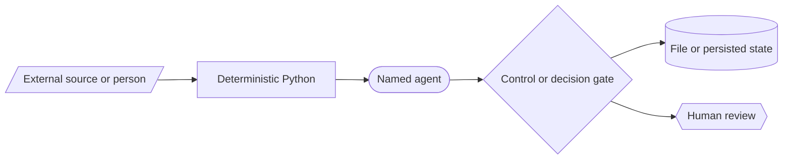
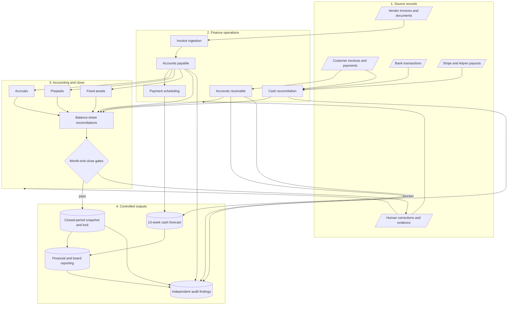
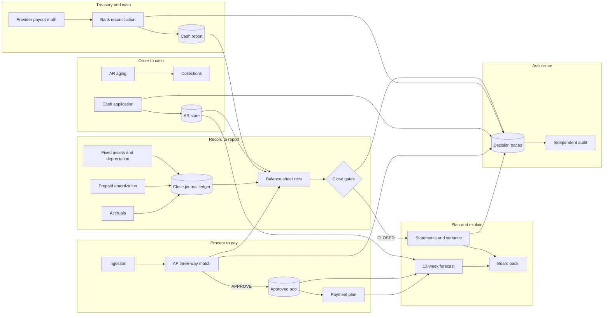
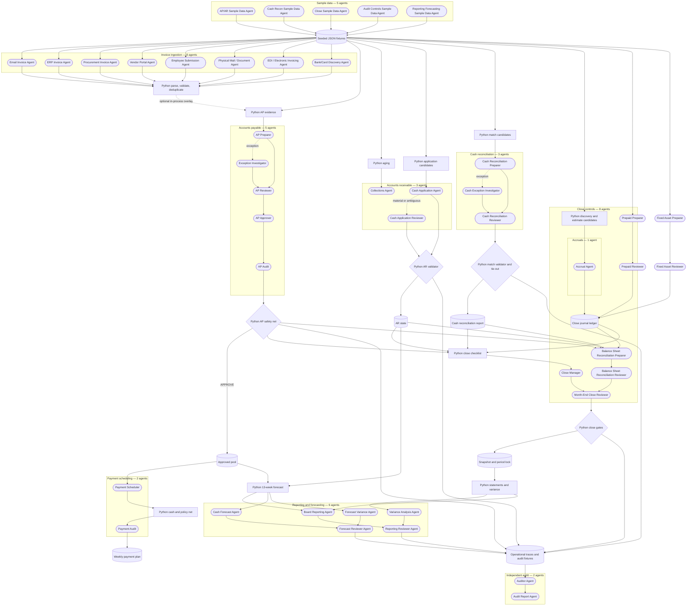
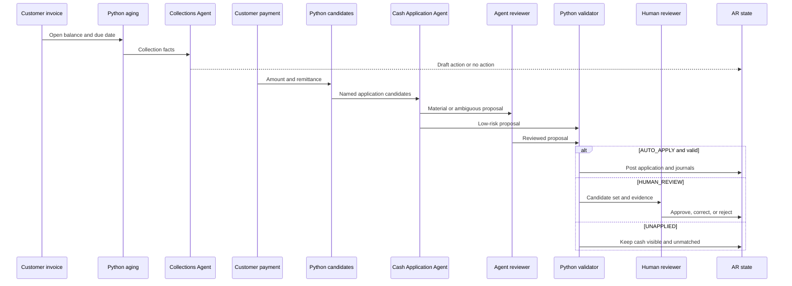
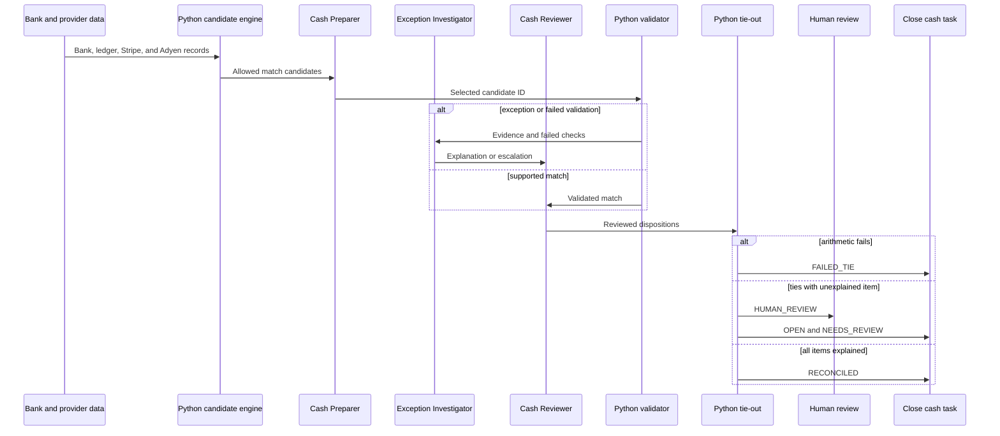
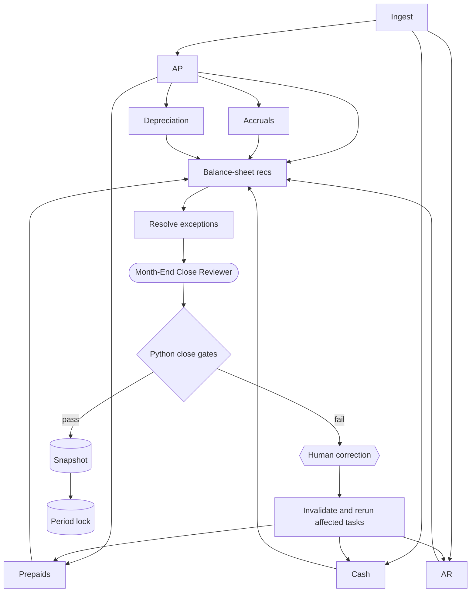
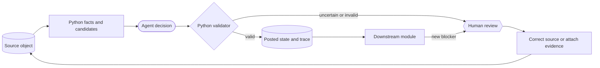

# Office of the CFO: System Maps and Decomposition Guide

This guide is a compact map of the implemented HackMIT system. It complements
the [detailed implementation guide](AGENTIC_SYSTEM_WORKFLOW.md), which remains
the source of truth, and maps the system to the
[Maximor challenge](../design-workshop/dominik/Maximor-HackMIT-Track.md).

The system is an **agent-assisted finance operating system** for a synthetic
company. It connects vendor payments, customer collections, cash
reconciliation, month-end close, reporting, forecasting, and audit.

## 1. First: Which Nodes Are Agents?

Not every node in the diagrams is an agent.



Use these shapes throughout this document:

- **Rounded node:** a named agent that can use an LLM.
- **Rectangle:** deterministic Python, an orchestrator, or a finance module.
- **Cylinder:** persisted JSON state, a ledger, or a run artifact.
- **Diamond:** a deterministic gate or branch.
- **Hexagon:** a human review point.
- **Slanted node:** an external source or actor.

Four facts prevent a misleading reading of the architecture:

1. The repository defines **43 named agents**.
2. Many runs use deterministic fallbacks instead of live LLM calls.
3. Python owns amounts, candidates, validation, posting, and close gates.
4. Agent handoffs use structured objects in one process or persisted JSON.
   There is no peer-to-peer agent message bus.

## 2. What the Whole System Is

The system turns financial source records into controlled accounting state. It
then uses that state for close, forecasts, reports, and audit.



This is one connected function, not a set of independent demos. Shared
transaction IDs and persisted state connect the modules. The repository does
not have one physical general ledger; several ledgers share IDs and provenance.

## 3. Macro Module Map

This diagram shows the main module boundaries and the most important
cross-module pathways.



The cleanest decomposition uses six bounded contexts:

- **Procure to pay:** decide whether and when the company can pay a vendor.
- **Order to cash:** track customer debt and apply incoming cash.
- **Treasury and cash:** explain bank and provider settlement activity.
- **Record to report:** post period adjustments, reconcile accounts, and close.
- **Plan and explain:** forecast cash and explain financial results.
- **Assurance:** challenge the work without changing the source books.

Each context owns one financial question, its deterministic rules, its agent
roles, and its state. Shared IDs, status contracts, and trace artifacts form the
boundaries between contexts.

## 4. Complete Agent Topology

This is the complete inventory of all 43 named agents. These are capability
definitions, not 43 concurrent workers. The arrows show implementation-level
handoffs. They do not imply that every agent runs in every scenario.



The large graph is useful as a roster and boundary map. The next diagrams are
better for reasoning about behavior because each one isolates one financial
cycle.

## 5. Isolated Decomposition: Procure to Pay

```mermaid
sequenceDiagram
  participant Source as Vendor source
  participant Ingest as Ingestion agents
  participant Parse as Python normalization
  participant AP as AP agent team
  participant Safety as Python safety net
  participant Pool as Approved pool
  participant Sched as Scheduler agents
  participant Policy as Python payment policy
  participant Down as Forecast and close

  Source->>Ingest: Invoice or source record
  Ingest->>Parse: Extracted candidate
  Parse->>Parse: Validate and deduplicate
  Parse->>AP: Invoice plus PO, receipt, and policy facts
  AP->>Safety: APPROVE or HOLD
  alt supported approval
    Safety->>Pool: Add approved invoice once
    Pool->>Sched: Eligible payment candidates
    Sched->>Policy: Proposed weekly plan
    Policy->>Down: Legal plan and forecast outflow
  else hold or failed safety check
    Safety->>Down: Held item; no committed payment
  end
```

This unit answers two separate questions:

1. **AP:** Is this invoice valid enough to pay?
2. **Treasury:** Should the company pay it this week?

The split matters. Approval does not execute a payment, and scheduling cannot
rescue a held invoice.

## 6. Isolated Decomposition: Order to Cash



AR aging does not need an agent. Python computes it. Agents choose collection
actions and select from application candidates. Only a valid application
changes invoice balances, close inputs, and forecast collections.

## 7. Isolated Decomposition: Cash Reconciliation



Agents can choose and explain candidates. They cannot invent transactions,
fees, or amounts. A reconciliation can tie arithmetically and still remain
`OPEN`; the seeded $12.40 difference demonstrates this rule.

## 8. Isolated Decomposition: Month-End Close



Close is the main long-horizon coordinator. A task starts only after its
dependencies complete. Reviewers can recommend closure, but Python rejects the
recommendation if tasks, reconciliations, evidence, reviews, or journals fail a
gate.

## 9. The Real Feedback Loop

The apparent “back-and-forth between agents” is usually a controlled rerun
through source state, not an open conversation between agents.



This loop preserves auditability:

- The original discrepancy stays visible.
- A human changes the source object or supplies missing evidence.
- The system rebuilds facts and reruns the affected workflow.
- The new decision gets a new trace.
- Downstream close, forecast, and report state changes only after validation.

## 10. How to Divide the Work

A practical implementation split follows the bounded contexts in section 3:

1. **Foundation:** shared IDs, money rules, structured outputs, traces, and
   idempotent persistence.
2. **Procure to pay:** ingestion, AP, approved pool, and scheduling.
3. **Order to cash:** aging, collections, cash application, and AR review.
4. **Treasury:** bank candidates, provider payouts, validation, and tie-out.
5. **Record to report:** accruals, prepaids, assets, balance-sheet recs, and
   close gates.
6. **Plan and explain:** statements, variance, forecast, and board output.
7. **Assurance:** independent sampling, controls, re-performance, and findings.
8. **Integration:** cross-workflow fixtures, close scenario, discrepancy tests,
   and the judge demo.

Keep these contracts stable between units:

- One economic event keeps one ID across workflows.
- Agents select from Python-produced candidates.
- Validators control all state changes.
- Human review changes source state, then causes a rerun.
- Audit reads operational artifacts but does not rewrite the books.
- Close consumes module results and does not duplicate their accounting logic.

This division lets teams build modules in parallel while preserving one company
story and one defensible chain of evidence.
