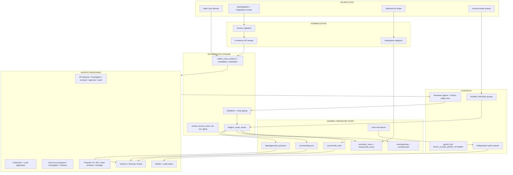
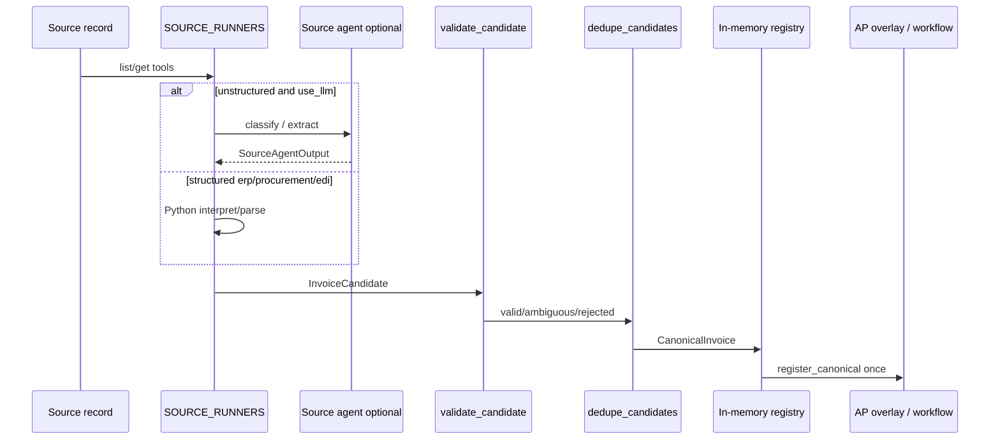
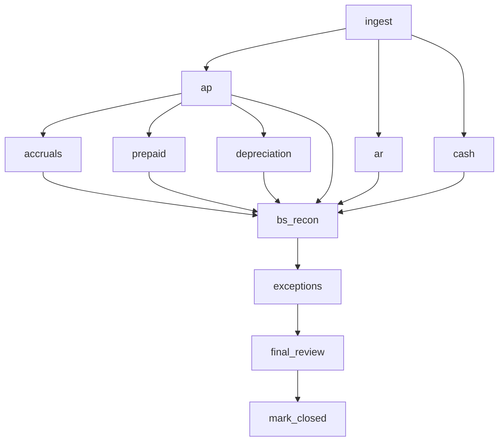
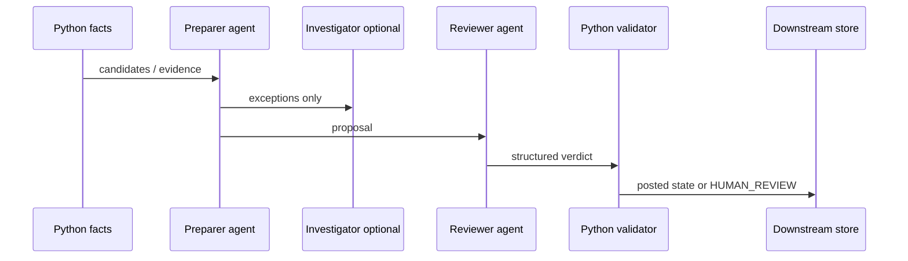
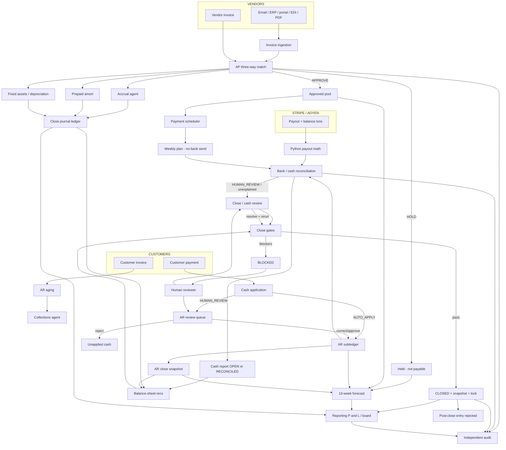

# Agentic Office of the CFO: System Architecture and Workflow

This is the canonical architecture and workflow document for this repository. It describes the system that **actually exists in code**, not a target design.

**Code wins.** Where `README.md` or comments disagree with implementation, this document follows the implementation and records the inconsistency.

Four layers appear in every workflow:

1. **Source data** — seeded JSON, mock provider payloads, optional live Stripe, human corrections.
2. **Deterministic financial engine** — Python arithmetic, candidate generation, matching, posting, gates, idempotency.
3. **Agentic reasoning** — structured LLM decisions over those facts: choose a candidate, interpret an exception, write an explanation, escalate.
4. **Controls / human oversight** — validators, reviewer agents, `HUMAN_REVIEW` queues, close gates, audit re-performance, period lock.

Agents reason. Python calculates. An LLM never owns a ledger total.

---

## 1. What This System Does

This repository is a connected **Office of the CFO** for a seeded company (Maximor Demo Corp / the operational September 2026 books). It is not five isolated demos that happen to share a repo.

Specialized agents handle accounts payable, invoice ingestion, payment scheduling, accounts receivable, bank reconciliation, Stripe/Adyen payouts, expense accruals, prepaid amortization, fixed-asset depreciation, month-end close, financial reporting, a 13-week cash forecast, and independent audit. They share identities, amounts, traces, and (where wired) the same operational files.

**Why connected state matters:** a vendor invoice that is held must not become a cash outflow, a forecast commitment, or a clean close item. A customer payment that is applied must change aging, the AR snapshot used at close, and later forecast inflows. A $12.40 unexplained bank difference can make the arithmetic of the bank rec *tie* and still leave the period `OPEN` and the month-end close `BLOCKED`.

Supported chains (implemented, not aspirational):

```text
Vendor invoice
  → ingestion (optional overlay) / data/invoices.json
  → AP three-way match (APPROVE | HOLD)
  → approved pool (APPROVE only)
  → payment schedule (plan only; no bank execution)
  → cash forecast AP outflows
  → cash recon / close AP results
  → reporting / audit evidence

Customer invoice
  → AR aging
  → collections action (draft / outbox; not a live mailer)
  → incoming payment
  → cash application (AUTO_APPLY | HUMAN_REVIEW | UNAPPLIED)
  → AR subledger + journals
  → forecast collections + close AR snapshot
  → bank rec / audit

Stripe / Adyen payout
  → ProviderPayout + Python payout math
  → cash recon PROVIDER_PAYOUT candidate
  → never an AP invoice

AP + AR + cash + accruals + prepaids + fixed assets + ledger
  → balance-sheet recs
  → close gates
  → BLOCKED or CLOSED
  → snapshot + period lock
  → reporting / forecast / audit
```

The system is a **HackMIT demo**: books are JSON files, most “providers” are mocks, live agents are optional, and several workflows can run fully deterministically without an API key.

---

## 2. System Architecture at a Glance



Cross-workflow connections that the code actually makes:

| From | To | Mechanism |
| --- | --- | --- |
| AP `APPROVE` | Payment pool | `scheduling.pool.add_approved` |
| Held AP | Forecast | Held invoices are listed, not committed (`reporting/sources.py`) |
| AR posted apply | Aging, close, forecast | `runs/ar/state.json` outstanding balances |
| Cash recon unexplained | Close cash task | `_run_cash` → `NEEDS_REVIEW` |
| Close blockers | Human review | `close/reviews.py` + `close/actions.py` |
| Resolved reviews | Downstream tasks | `invalidate_downstream` + `rerun_affected` |
| Close journals | Reporting | `reporting/posting.py` can write both ledgers |
| Operational IDs | Audit | Dedicated `data/audit/` copy + traces; auditor does not rewrite books |
| Stripe payouts | Cash recon | `cash_recon/providers.py` → `integrations.cash.reconcile_payout` |

---

## 3. Design Philosophy

| Principle | What the code does | Where |
| --- | --- | --- |
| Agents reason; Python calculates | Agents receive structured facts and choose among named candidates. Python computes amounts, aging, schedules, and tie-outs. | Every workflow module; `tools.collect_case_evidence`, `cash_recon/candidates.py`, `accrual/estimation.py`, `reporting/forecast.py` |
| Structured outputs | OpenAI Agents SDK `output_type=` is a Pydantic model (`PreparerRecommendation`, `AccrualDecision`, `FinalCloseVerdict`, …). | `agent.py`, domain `*/agent.py` / `*/agents.py` |
| Integer-cent money where cash must tie | Cash recon stores `amount_minor` and computes tie-out in cents. Display fields stay major units. | `cash_recon/models.py`, `cash_recon/validate.compute_tie_out` |
| Dollar rounding elsewhere | Most other modules use float dollars plus `money()` / `close.dates.money` / `accrual.estimation.money`. | Accrual, close, reporting, AR |
| Candidate-constrained decisions | Agents may pick a Python `candidate_id` or escalate. They must not invent a combination. | Cash recon, AR cash apply, accruals, prepaids |
| Evidence-backed decisions | Safety text forbids inventing invoices, POs, fees, or residual stories. | Agent `SAFETY` blocks |
| Preparer / reviewer separation | Preparer proposes; a second agent reviews; Python can override. | AP, cash recon, prepaid, FA, BS rec, reporting, close |
| Human escalation | First-class `HUMAN_REVIEW` in AR, cash recon, close, BS rec, some audit controls. **AP has no human path** (`APPROVE`/`HOLD` only). | `ar/review.py`, `cash_recon/validate.py`, `close/reviews.py` |
| Idempotency | Journal keys, ingestion handoff set, cash-recon replay, AR already-posted guard, close journal keys. | `close/ledger.py`, `invoice_ingestion/registry.py`, `ar/cash.py` |
| Persistent run artifacts | Each workflow writes JSON under `runs/` and/or `traces/`. | See §32 |
| Audit trails | Decision traces include Python facts, agent outputs, validators, skill hashes. | `DecisionTrace`, `MatchTrace`, `CashApplyTrace`, close snapshots |
| Shared identity, multiple ledgers | The **same invoice/payment IDs** travel across workflows. There is **not** one physical general ledger. Close, AR, accrual, reporting, and cash-recon fixtures keep separate books and sometimes bridge them. | `close/ledger.py`, `ar/ledger.py`, `accrual/ledger.py`, `reporting/ledger.py` |
| Surface discrepancies; do not silently fix them | Unexplained $12.40 stays unexplained. Duplicate refunds stay flagged. Missing prepaid evidence blocks amortization. | `cash_recon/validate.period_status`, `prepaid/workflow.py`, `close/gating.py` |
| Skills injected into prompts | No Agents SDK filesystem sandbox. `compose_instructions` embeds `SKILL.md` bodies. | `skills/loader.py` |
| Live LLM optional | Most demos and tests run deterministic fallbacks when `use_agent=False` / no `OPENAI_API_KEY`. | `close/agents.decide_final_close`, `reporting/workflow._maybe_agent` |

---

## 4. Full System Component Map

| Component | Responsibility | Agents | Deterministic logic | Inputs | Outputs | Downstream consumers |
| --- | --- | --- | --- | --- | --- | --- |
| Invoice ingestion | Collect and canonicalize source documents | 8 source agents | Parse/validate/dedupe/identity/handoff | `data/ingestion/`, integrations | `InvoiceCandidate`, `CanonicalInvoice`, `runs/ingestion/` | AP overlay, close ingest task |
| Integrations | Normalize email/ERP/payout events | none as finance agents | Signature verify, payout math, ingest | Mock fixtures; optional live Stripe | `InvoiceCandidate` or `ProviderPayout` | Ingestion, cash recon |
| AP matching | Approve or hold vendor invoices | AP Preparer, Investigator, Reviewer, Approver, AP Audit | Three-way facts, tolerances, safety net | `data/invoices.json` + PO/GR/policies | `DecisionTrace`, pool write on APPROVE | Scheduling, close AP, forecast holds |
| Payment scheduling | Which approved bills to pay this week | Payment Scheduler, Payment Audit | Spendable cash, P-012–P-016 net | `data/approved_pool.json`, `cash_position.json` | `ScheduleTrace` (no bank send) | Forecast AP lines, CFO packet |
| AR aging | Bucket open receivables | none | Days past due, buckets | `runs/ar/state.json` / seed | `AgingReport` | Collections, close snapshot, forecast |
| AR collections | Next chase action | Collections Agent | Candidate facts + `enforce_collection_decision` | Aging + customer | `CollectionRun`, outbox | Human drafts; not a mail API |
| AR cash application | Apply remittances | Cash Application Agent + Reviewer | Candidate combos, validate, post | Payments + invoices | Posted apply or review queue | Ledger, forecast, close, audit |
| Cash / bank rec | Match bank to cash ledger | Preparer, Investigator, Reviewer | Candidates, cents tie-out, dispositions | `data/cash_recon/` + Stripe/Adyen | `CashReconciliationReport`, `REC-*` traces | Close cash + Cash BS rec |
| Stripe / Adyen | Payout vs charges/fees/refunds | none | `integrations.cash.reconcile_payout` | Webhook/sync or mock | `MATCH` / `MISMATCH` / … | Cash recon `PROVIDER_PAYOUT` |
| Accruals | Book unbilled incurred expense | Accrual Agent | Discovery + named estimate candidates | Contracts, usage, POs, GRs, history | Accrual JE + traces | Close accruals, BS accrued expenses |
| Prepaids | Amortize prepaid assets | Prepaid Preparer/Reviewer | Straight-line / daily / immediate candidates | `data/close/prepaids.json` | Amortization JEs | Close, Prepaid BS rec |
| Fixed assets | Capitalize + depreciate | FA Preparer/Reviewer | Straight-line schedule, duplicates | `data/close/capital_invoices.json` | Asset register + dep JEs | Close, FA / Accum Dep recs |
| Month-end close | Coordinate + gate the period | Close Manager, Month-End Close Reviewer | Checklist DAG, gates, lock, snapshot | All of the above | `MonthEndState`, snapshot, lock | Reporting, audit, post-close control |
| BS recs | Ledger vs evidence per account | BS Preparer/Reviewer | `classify_packet`, sign-off rules | Close subsystem outputs | `BSR-*` recs | Close gates |
| Reporting | P&L / statements from reporting ledger | Variance, Reviewer, Board | `statements.py`, `ledger.py` | `data/reporting/` + posted JEs | Period report, board pack | Demo / eval |
| 13-week forecast | Rolling cash plan | Forecast + Reviewer + Variance | `build_forecast` only | AP pool, AR state, payroll, other | Immutable snapshots | Actuals compare, board |
| Independent audit | Challenge operational work | Auditor, Audit Report | Sampling, controls, reperformance | `data/audit/` + traces | Findings + report | Eval / demo |
| Sample data | One consistent synthetic company | 5 sample-data agents | IDs, amounts, journals | Scenario registry | `data/demo/` | Eval harness |
| Discrepancy eval | Score planted breaks | none (scorer) | Contract matching | `discrepancy/catalog.py` | `runs/discrepancy_eval/` | Benchmark |
| Skills / context | Reusable procedures + snapshots | n/a | Loader, assignments, AR/close snapshots | `skills/*/SKILL.md` | Injected instructions | All agents |

# PART I — ACCOUNTS PAYABLE

## 5. Invoice Ingestion

**Finance meaning:** companies receive the same bill many ways (email PDF, vendor portal, EDI, ERP). Ingestion’s job is to recognize “this is one invoice” and hand a clean record to AP. It does **not** decide whether to pay.

### Path



Implemented in `invoice_ingestion/workflow.py` (`ingest_invoices`, `ingest_candidates`, `_finalize_candidates`).

**Sources** (`invoice_ingestion/models.py`):

| Source | Structured? | Agent (when `--llm`) | Tools |
| --- | --- | --- | --- |
| `email` | No | Email Invoice Agent | `list_email_candidates`, `get_email`, `get_email_attachment` |
| `erp` | Yes | ERP Invoice Agent (Python maps; no assigned skills) | `list_erp_invoice_records`, `get_erp_invoice` |
| `procurement` | Yes | Procurement Invoice Agent | Coupa-style list/get |
| `vendor_portal` | No | Vendor Portal Agent | portal list/get |
| `employee_submission` | No | Employee Submission Agent | employee list/get |
| `document` | No | Physical Mail / Document Agent | mail list/get |
| `edi` | Yes | EDI / Electronic Invoicing Agent | prefers `python_parse` |
| `bank_card` | No | Bank/Card Discovery Agent | bank txn + `find_related_invoice` |

**Python owns:** structured parse (`invoice_ingestion/interpret.py`, `edi.py`), `validate_candidate` (required fields, tax+subtotal, duplicate `source_type:source_id`), `canonical_invoice_key` (normalized vendor + invoice number), document-hash secondary index, registry replay, AP handoff idempotency.

**Agents may:** classify messy documents, extract fields that are present, explain ambiguity. They may **not** approve, three-way match, accrue, schedule payment, invent fields, or turn a card charge into an invoice without supporting documentation.

**Validation statuses:** `valid` | `rejected` | `ambiguous` (extraction confidence < 0.5).

**RecordTrace statuses** after annotate: `new_invoice`, `duplicate_within_run`, `already_present_in_ap`, `new_provenance`, `source_replay`, `not_an_invoice`, `missing_supporting_documentation`.

**Persistence:** in-process registry + optional AP overlay (`tools.register_runtime_invoice`). **Not** written to `data/invoices.json`. Traces go to `runs/ingestion/ingest-{period}-{stamp}.json`.

**Sample behavior:** AWS `INV-9001` from email + portal + card becomes one canonical invoice and is forwarded to AP once. Acme `ACM-2026-4410` maps to existing `INV-001` and is not forwarded again. A WeWork card charge with no invoice stays `invoice_missing`.

**Close:** `_run_ingest` calls `ingest_invoices(..., use_llm=False, forward_to_ap=False, run_ap=False)` — ingestion is recorded, not used as the AP inbox for the period close.

---

## 6. Three-Way Matching

**Finance meaning:** before paying a vendor, the bill should match what was ordered (purchase order) and what was received (goods receipt). That is a **three-way match**.

### Deterministic facts

`tools.collect_case_evidence(invoice_id)` builds `APCaseEvidence`:

- PO exists / approved
- Vendor exact vs similar
- Amount difference and percent vs `po.authorized_amount`
- `within_amount_tolerance` from policy **P-009** (max **$300** and **3%**)
- Receipt: `missing` | `not_received` | `partial` | `full` | `not_applicable`
- Duplicates via normalized vendor invoice number
- `exception_types` from `exception_types_for`
- `vendor_alias_established` from prior cases (`CASE-001`)

**Exception types:** `duplicate`, `missing_po`, `po_not_approved`, `goods_not_received`, `partial_receipt`, `vendor_mismatch`, `small_amount_discrepancy`, `material_amount_mismatch`, `unusual_timing`, `approval_limit_exceeded`, `unknown_invoice`.

### Agent chain

`workflow.run_ap_workflow`:

1. Python evidence
2. **AP Preparer** → `APPROVE` | `HOLD` | `INVESTIGATE`
3. **Exception Investigator** if `exception_types` or preparer said `INVESTIGATE`
4. **AP Reviewer** → `APPROVE` | `HOLD`
5. **AP Approver** → `APPROVE` | `HOLD` (“there is no human approver”)
6. **AP Audit** → `passed` / `requires_reconsideration`
7. Python `_apply_safety_net` + at most one reconsideration (`MAX_RECONSIDERATIONS = 1`)
8. `_build_final`: APPROVE that fails audit becomes **HOLD**

There is **no AP `HUMAN_REVIEW` state**. Agents are instructed not to ask a person. Uncertain cases become `HOLD`.

`cfo/company.py` labels `INV-016` as `ap_human_review`. That is a **storyline name**. The AP engine’s actual decision space is still `APPROVE` | `HOLD`.

### Sample invoices (`data/invoices.json`)

| Invoice | What Python sees | Likely / enforced result |
| --- | --- | --- |
| `INV-001` | Clean Acme three-way, PO-101, $12,450, full GR | APPROVE; investigator skipped |
| `INV-011` | Stripe $10,250 vs PO $10,000; within P-009 | May APPROVE after investigation |
| `INV-016` | `po_id` null → `missing_po` | HOLD (P-008); safety net blocks APPROVE |
| `INV-017` | `Acme Supply Co.` vs `Acme Supplies`; alias via CASE-001 | Safety net does not block P-006 |
| `INV-018` | Duplicate of `INV-010` (`NL-INV-088421`) | HOLD (P-002) |
| `INV-021` | Not in AP inbox; `$60,000` Dell in `data/close/capital_invoices.json` | Close AP synthesizes APPROVE for capitalization |

**Clean path:** evidence has no exceptions → preparer → skip investigator → reviewer → approver → audit → APPROVE → `add_approved` → `data/approved_pool.json` + `runs/{INV}-*.json`.

**Problematic path:** exceptions → investigator + policies/prior cases → reviewer/approver → if anyone APPROVEs a must-hold, safety net forces audit fail and HOLD.

---

## 7. AP Approval and Payment Scheduling

**Finance meaning:** matching says the invoice is valid enough to pay. Treasury still decides **which** valid invoices to pay *this week* given cash, due dates, and early-pay discounts.

**Who approves:** the autonomous **AP Approver**, constrained by Python safety net. There is no human AP approver in this workflow.

**Payment eligibility:** `scheduling.cash.policy_eligible_for_pool` / `BLOCKING_EXCEPTIONS` — HOLD-class exceptions never enter the live pool. Demo seed `seed_demo_pool()` only adds policy-eligible invoices.

**Scheduler flow** (`scheduling/workflow.run_schedule_workflow`):

1. Load `data/cash_position.json`
2. Build candidates from `data/approved_pool.json`
3. Payment Scheduler proposes `PaymentPlan`
4. Python `apply_cash_and_policy_net` is authoritative
5. `compute_metrics`
6. Payment Audit; Python fails audit if `not plan.reserve_ok` (P-013)
7. Trace `runs/schedule-*.json`

**Spendable cash (Python):**

```text
bank + expected receipts − payroll − other commitments − minimum reserve
```

Seed as-of 2026-09-19: **$115,000**. Expected receipts for scheduling now prefer live AR (`canonical_expected_receipts` / `receipts_source_of_truth`).

**Policies P-012–P-016** (Python net, not the LLM):

| ID | Rule |
| --- | --- |
| P-012 | Only approved pool invoices |
| P-013 | Do not breach minimum reserve |
| P-014 | Capture open early-pay discounts when cash allows |
| P-015 | Pay late / due-this-horizon first |
| P-016 | Do not pay early if discount is closed and not due this horizon |

**No bank payment is executed.** The output is a plan plus metrics (on-time %, discounts captured, late fees avoided, reserve violation, unnecessary early payments, cash retained).

**Forecast:** scheduled / approved AP invoices become negative `ForecastLine`s via `reporting.sources.ap_forecast_lines`. Held `INV-016` is listed, not committed.

# PART II — ACCOUNTS RECEIVABLE

## 8. AR Lifecycle

**Finance meaning:** customers owe money (receivables). The team ages those balances, chases payment, and when cash arrives, applies it to the right invoices.

```text
CustomerInvoice
  → aging buckets
  → collections decision / outbox
  → CustomerPayment arrives
  → generate_cash_candidates
  → AUTO_APPLY | HUMAN_REVIEW | UNAPPLIED
  → post_application (only AUTO_APPLY)
  → invoice outstanding + AR journals
  → ar_close_snapshot + forecast lines
```

**Canonical models** (`ar/models.py`): `Customer`, `CustomerInvoice`, `CustomerPayment`, aging/collection/cash-apply traces, `ARCloseSnapshot`, `ARState`.

**Persistence:** `runs/ar/state.json` (invoices, payments, applications, reviews, precedents, journals). Seed: `data/ar_invoices.json`, `ar_payments.json`, `ar_customers.json`, `ar_precedents.json`. Alias: `PAY-AMBIGUOUS` → `PAY-005`.

Invoice statuses: `OPEN`, `PARTIALLY_PAID`, `PAID`, `PAST_DUE`, `DISPUTED`.  
Payment application statuses: `UNMATCHED`, `PROPOSED`, `APPLIED`, `PARTIALLY_APPLIED`, `HUMAN_REVIEW`.

---

## 9. Receivables Aging

**Finance meaning:** “How late is each unpaid invoice?” Controllers group balances into buckets to see collection risk.

`ar/aging.py` `build_aging_report(as_of)`:

| Bucket | Meaning |
| --- | --- |
| `CURRENT` | Not yet due |
| `1-30` | 1–30 days past due |
| `31-60` | 31–60 |
| `61-90` | 61–90 |
| `90+` | 91+ |

Paid / zero-outstanding invoices are excluded. Partial and disputed amounts are totaled separately.

**Deterministic.** No aging agent. Collections and forecast *consume* the report.

CLI: `python main.py ar-aging --as-of 2026-09-30`.

---

## 10. Cash Application

**Finance meaning:** a customer payment hits the bank. Someone must say which invoice(s) it pays. Remittances are often messy.

**Python candidates** (`ar/cash.generate_cash_candidates`): `explicit_invoice`, `explicit_multi`, `exact_amount`, `combination`, `partial_single_open`, `global_exact_amount`. Competing explanations become `ambiguities`.

**Agent / policy:** Cash Application Agent (or `policy_cash_decision`) returns `CashApplicationProposal`: `AUTO_APPLY` | `HUMAN_REVIEW` | `UNAPPLIED`. Applications must copy a Python candidate.

**Validator** (`validate_proposal`): no over-apply, no paid invoices, currency match, `UNAPPLIED` must have empty applications.

**Reviewer** (`needs_reviewer`): AUTO_APPLY with competing candidates, applied ≥ $10,000, or confidence < 0.95. Reviewer may force `HUMAN_REVIEW`.

**Posting:** only final `AUTO_APPLY` that validates → `ar/ledger.post_application`. Second apply → `UNAPPLIED`, `already_posted=True`.

**HUMAN_REVIEW queue** (`ar/review.py`):

| Action | CLI | Effect |
| --- | --- | --- |
| Approve proposed allocation | `ar-review-approve` | Validate + `post_application`; status `APPROVED` |
| Correct | `ar-review-correct --apply INV:amount` | `record_human_application` + human precedent; `CORRECTED` |
| Reject | `ar-review-reject` | Payment stays `UNMATCHED`, full unapplied; `REJECTED` |

Corrections change invoice outstanding, so the next aging run, `ar_close_snapshot`, and `build_forecast` all see the new books. `tests/test_forecast_ar.py` and `ar-forecast-demo` prove PAY-005 correction updates the forecast.

**Seeded examples:**

| Payment | Behavior |
| --- | --- |
| `PAY-001` | Remits `INV-AR-001` → AUTO_APPLY $12,000 |
| `PAY-004` (operational `data/`) | Partial to `INV-AR-025` → AUTO_APPLY |
| `PAY-005` / `PAY-AMBIGUOUS` | Vague remittance, colliding amounts → HUMAN_REVIEW, not posted |
| `PAY-CLOSE-4500` | Injected in close demo: $4,500 unmatched Summit wire |

**Catalog vs operational data:** `discrepancy/catalog.py` `AR-DISC-003` uses `PAY-004` + `INV-AR-010`/`INV-AR-011` inside **discrepancy_demo** overlays. That is not the default `data/ar_payments.json` meaning of `PAY-004`.

# PART III — CASH AND RECONCILIATION

## 11. Bank Reconciliation

**Finance meaning:** the bank statement and the cash general ledger should explain each other. Differences are timing, fees, grouping, provider settlements, or real problems.

### Stages (`cash_recon/workflow.run_cash_reconciliation`)

```text
normalize (prepare_bank / prepare_ledger)
  → generate_all_candidates (Python universe)
  → propose_matches (disjoint assignment)
  → preparer (deterministic_prepare or agent)
  → validate_candidate (authoritative)
  → investigator if exception / failed validation / human_review_required
  → reviewer
  → compute_tie_out + period_status
  → report + traces/cash_recon/{period}/{run}/REC-*.json
```

**Why agents only choose Python candidates:** `engine.generate_all_candidates` is the universe. Tools (`get_match_candidates`, `get_candidate`) are read-only. `_apply_agent_choice` may swap only to another row in `related_candidates`. Instructions forbid inventing transactions or amounts. Proposed fee journals stay **unposted**.

**Match types:** `EXACT_MATCH`, `GROUPED_MATCH`, `FEE_NETTED`, `PROVIDER_PAYOUT`, `TIMING_DIFFERENCE`, `POSSIBLE_DUPLICATE_*`, `UNEXPLAINED_DIFFERENCE`, `UNMATCHED_BANK`, `UNMATCHED_LEDGER`.

**Dispositions:** `MATCHED`, `EXPLAINED_EXCEPTION`, `OUTSTANDING_TIMING_ITEM`, `HUMAN_REVIEW`.

**Period statuses:** `RECONCILED`, `OPEN`, `FAILED_TIE`.

`period_status` (`cash_recon/validate.py`): if the cents tie-out fails → `FAILED_TIE`. If it ties **but** any match is `HUMAN_REVIEW` or `UNEXPLAINED_DIFFERENCE` → **`OPEN`**. That is why **arithmetic can pass while the month stays OPEN**.

### Seeded September 2026 cases (`data/cash_recon/ground_truth.json`)

| ID | Case | Expected |
| --- | --- | --- |
| `TXN-2026-09-008` | One ACH / wire covering three vendor invoices (`INV-201`–`203`) | `GROUPED_MATCH` |
| `TXN-2026-09-011` | Wire net of known $25 fee `FEE-729103` | `FEE_NETTED` / `EXPLAINED_EXCEPTION` |
| `TXN-2026-09-012A` / `012B` | Duplicate card refund | first match, second `HUMAN_REVIEW` |
| `TXN-2026-09-015` | **$12.40** vs `GL-AR-NS` | `UNEXPLAINED_DIFFERENCE` / `HUMAN_REVIEW` |
| `TXN-2026-09-019A` / `019B` | Stripe / Adyen payouts | `PROVIDER_PAYOUT` if adapter MATCH |
| `TXN-2026-09-025` | Bank only | `UNMATCHED_BANK` |
| `GL-AP-OD-2` | Duplicate GL | `HUMAN_REVIEW` |
| `GL-AP-HE` vs Oct bank | Timing | `OUTSTANDING_TIMING_ITEM` |

`data/close/materiality.json` states materiality **never auto-explains** the $12.40 break.

Close: unexplained matches → cash task `NEEDS_REVIEW` → harvested review → Cash BS rec not `SIGNED_OFF` → period `BLOCKED`.

---

## 12. Stripe Integration and Payout Reconciliation

**Finance meaning:** Stripe (or Adyen) settles many charges minus fees and refunds into one bank deposit. That net must be reconciled; it is **not** a vendor invoice.

**Separation:** `integrations/providers/stripe.py` docstring: never produces `InvoiceCandidate`. Same for Adyen.

| Mode | How | Credentials |
| --- | --- | --- |
| **Mock (default)** | Fixtures under `data/integrations/stripe/`; `STRIPE_MODE=mock` | None |
| **Live (optional)** | Official Stripe SDK: verify `Stripe-Signature` on raw body, fetch payout, page balance transactions | `STRIPE_MODE=live`, `STRIPE_SECRET_KEY`, `STRIPE_WEBHOOK_SECRET` |

**Python payout math** (`integrations/cash.reconcile_payout`): integer minor units. Statuses: `MATCH`, `MISMATCH`, `AWAITING_BANK`, `NEEDS_REVIEW`.

**Cash recon:** `cash_recon/providers.provider_candidates` reads `integrations.store.all_payouts`. A provider MATCH becomes `PROVIDER_PAYOUT` / `MATCHED`. Non-MATCH → `HUMAN_REVIEW`.

**Other providers:** Gmail, Outlook, Xero, Coupa, NetSuite, Adyen are **mock/demo** adapters (`integrations/demo.process_provider`, `integrations/server.py` webhook routes). They are not production ERP connectors.

**Webhook server:** `python main.py webhook-server` → `POST /webhooks/{stripe,adyen,gmail,outlook,xero}`. Receipt is deterministic; agents do not verify signatures.

State: `runs/integrations/state.json`.

# PART IV — MONTH-END CLOSE

## 13. Month-End Close Architecture

**Finance meaning:** at month-end the books are frozen only after every material process is done and unexplained items are resolved. Close here is a **coordinator**, not a second accounting system.

**Canonical engine:** `close/month_end.py` via `close/engine.py`.  
**Not the period state machine:** `close/orchestrator.run_cfo_close` — AP + accrual + schedule packet used by tests; does **not** write period lock or `CLOSED`.



A task is `READY` only when every dependency is `COMPLETE`. Upstream `NEEDS_REVIEW` / `FAILED` / `BLOCKED` blocks dependents (`close/checklist.py`).

Owner agents on the checklist are labels for routing; many tasks run deterministic Python unless `live=True`.

---

## 14. Accruals

**Finance meaning:** goods or services were used this month, but the vendor invoice has not arrived. GAAP still wants the expense in this month. That booking is an **accrual** (debit expense, credit accrued expenses). When the invoice arrives, the accrual is reversed and the real bill is booked.

**Python discovery** (`accrual/discovery.py`): cadence, contracts, usage, POs, receipts → expected expenses and missing bills. A current-period invoice **skips** that vendor (`invoice_already_received`). An unbilled goods receipt **must** accrue (`_force_goods_receipt`).

**Estimate candidates** (`EstimationMethod`): `last_invoice`, averages, `linear_trend`, `seasonal_prior_year`, `contract_commitment`, `usage_run_rate`, `goods_receipt`, `purchase_order`, `conservative_minimum`. Amounts come from `compute_estimate`.

**Accrual Agent** chooses `accrual_required` | `no_accrual_needed` | `insufficient_evidence` and a method. `_book` recopies the Python amount; malformed decisions become `failed_safe_decision`.

**Journals:** `accrual/ledger.py` — balanced entries, duplicate/second-reconcile blocked. Reconciliation (`reconcile_accrual`) measures estimate vs later invoice (Aether example: usage $11,849.90 vs later $12,100 → +$250.10 error, then reverse + book actual).

**Traces:** `traces/accruals/{period}/{run}/`. Close calls `run_accrual_workflow` from `_run_accruals`.

**No human accrual approver** in agent safety text. Weak evidence → `insufficient_evidence`, which close records as an exception but the accruals *task* still completes.

---

## 15. Prepaids

**Finance meaning:** you paid for insurance or software covering future months. That payment is an **asset** (prepaid). Each month you **amortize** a slice to expense.

**Python:** `prepaid/schedule.treatment_candidates` — `straight_line_monthly`, `daily_prorate`, `immediate_expense`. Agents pick an applicable candidate. Missing `evidence_refs` / `source_document_id` → do not amortize.

**PRE-INS-MISSING:** seeded Northshore insurance without policy evidence. Deterministic preparer selects `insufficient_evidence`; reviewer `REQUEST_EVIDENCE`; item status `review`. Close `evidence_gaps()` and `_run_prepaid` surface *“Prepaids: missing insurance policy evidence”*. Demo resolution attaches `DOC-NS-FLOOD-2026` (`close/actions.py`).

Clean/seed_demo scenarios drop the missing-insurance plant so close can finish after cash is resolved.

Journals are idempotent (`test_prepaid.py`). Late-discovery catch-up is supported.

---

## 16. Fixed Assets

**Finance meaning:** a $60,000 server is not a one-month expense. It is **capitalized** as a fixed asset and **depreciated** over its useful life.

**Python:** `should_capitalize(amount, useful_life_months)` — simple cost/life rule. `fixed_assets/schedule.py` straight-line to salvage; do not depreciate before placed-in-service; accumulated depreciation ceiling; duplicate vendor+cost+date → `duplicate_review`, not a second register.

**INV-021:** Dell server $60,000 in `data/close/capital_invoices.json`. Close `_run_ap` adds synthetic APPROVE. FA workflow capitalizes and posts monthly depreciation. Identity link `kind=capital_invoice`. Tests expect $1,000 straight-line month (`test_seed_server_straight_line_is_one_thousand`).

**INV-021-DUP** is flagged, not double-entered.

Journals post to `close/ledger.py`. Downstream: Fixed Assets and Accumulated Depreciation BS recs.

---

## 17. Balance-Sheet Reconciliations

**Finance meaning:** for each balance-sheet account, the **book (ledger) balance** should equal **independent evidence** (subledger, rec, schedule). The difference is classified, not forced to zero.

**Accounts** (`close/gating.REQUIRED_ACCOUNTS`): Cash, Accounts Receivable, Accounts Payable, Accrued Expenses, Prepaid Expenses, Fixed Assets, Accumulated Depreciation.

`bs_recon/packets.build_packets` builds a `ReconPacket` per account. `classify_packet` findings: `exact_match`, `explained_timing_difference`, `unexplained_difference`, `missing_evidence`, `stale_evidence`, `duplicate_support`, `arithmetic_inconsistency`.

**Statuses:** `NOT_STARTED`, `IN_PROGRESS`, `MATCHED`, `EXPLAINED_DIFFERENCE`, `HUMAN_REVIEW`, `BLOCKED`, `SIGNED_OFF`.

Sign-off is allowed only for exact match or Python-supported timing. Unexplained / missing evidence → escalate or request evidence. **Never silently force a match.**

Demo: Cash carries $12.40; AR carries $4,500 unmatched; Prepaids carry missing Northshore support → those recs are not `SIGNED_OFF` → gates fail.

---

## 18. Close Gates

`close/gating.evaluate_close_gates` — agents cannot override. `decide_final_close` rewrites `APPROVE_CLOSE` to `REJECT_CLOSE` when `gate.passed` is false (`overridden_by_python=True`).

| Gate | Condition | Blocks close? | Remediation |
| --- | --- | --- | --- |
| Required tasks complete | All tasks except `final_review` and `mark_closed` are `COMPLETE` | Yes | Finish or resolve upstream `NEEDS_REVIEW` |
| BS recs signed off | Every required account `SIGNED_OFF` | Yes | Resolve unexplained / attach evidence / rerun |
| No blocking reviews | No review in `OPEN`, `IN_REVIEW`, `REJECTED`, `NEEDS_MORE_EVIDENCE` | Yes | `resolve_review_item` then `rerun_affected` |
| Evidence complete | No `PRE-INS-MISSING` / review prepaids without docs | Yes | Attach `DOC-NS-FLOOD-2026` |
| Journal safeguards | Balanced, debit > 0, `evidence_refs`, unique `idempotency_key` | Yes | Fix posting |

**Semantics:**

| State | Meaning |
| --- | --- |
| `NEEDS_REVIEW` | Task ran; humans/reviewers must act (cash unexplained, BS blockers) |
| `BLOCKED` | Cannot start or finish because upstream or gates failed |
| `HUMAN_REVIEW` | Item-level (cash match, BS rec, AR payment) |
| `READY_TO_CLOSE` / `CLOSED` | Gates + `APPROVE_CLOSE` + `mark_closed` + snapshot + lock |
| `REOPENED` | `reopen_period` after close |

**Seeded demo:** `$12.40` cash + `$4,500` AR + missing Northshore → `BLOCKED`.  
`--clean` is a hidden fixture that drops those plants — **not** the successful-close story. The judge path is `demo_month_end_close.py --resolve`: mutate source objects, `rerun`, `finalize` → `CLOSED`. Later September journal → `POST_CLOSE_ENTRY_ATTEMPT` (`close/period_lock.assert_period_open`). Verified in `tests/test_close_canonical.py`, `tests/test_month_end_close.py`, `tests/test_cfo_integration.py`.

---

## 19. Close Snapshot / Immutability

On `mark_closed`:

- `close/snapshot.build_snapshot` → `runs/month_end/snapshots/{period}-{stamp}.json`
- `period_lock.mark_period(CLOSED)` → `runs/month_end/period_lock.json`
- State file `runs/month_end/{period}.json`

Snapshot includes ledger balances, recs, review items, gate, verdict, roll-forwards, journal IDs.

`post_journal_entry` / `assert_period_open` records `POST_CLOSE_ENTRY_ATTEMPT` and raises `ClosedPeriodError` unless `allow_closed=True`.

Rerunning completed journal keys hits idempotency (`close/ledger.find_by_key`, `_replay_hits`). Reopen preserves the prior snapshot and requires a new close (`test_reopen_preserves_snapshot_and_requires_reclose`).

# PART V — REPORTING AND FORECASTING

## 20. Reporting Architecture

Reporting is **not** a second set of invent-the-numbers books. `reporting/ledger.py` + `reporting/statements.py` aggregate a **reporting ledger** (seed `data/reporting/` plus posted lines). Operational AP/AR IDs are reused. `reporting/posting.py` can post the same AP payment into `close.ledger` and `reporting.ledger`.

`reporting/workflow.run_reporting_workflow`:

1. Optional seed (`seed_demo_ledger`)
2. `period_report` — P&L actuals (August/September demo is synthetic at statement level; transaction IDs are canonical)
3. `analyze_variance` — Python attribution
4. Variance Analysis Agent narrates (or deterministic narrative)
5. Reporting Reviewer
6. `build_forecast`
7. Cash Forecast Agent + Forecast Reviewer
8. `build_board_pack`
9. Board Reporting Agent + reviewer
10. Persist run under `runs/reporting/`

Period selection: `period` + `as_of` (defaults `2026-09` / `2026-09-19`). Provenance links via `close.context.remember_link`.

There is **no full balance-sheet statement builder** comparable to the P&L. Balance-sheet *reconciliations* live in close/`bs_recon`.

---

## 21. Variance Analysis

**Finance meaning:** why did a metric move vs last period or budget?

`reporting/variance.analyze_variance` attributes the dollar move to accounts and underlying transactions (`trace_variance`). Contributors are tagged verified vs likely. A **residual** stays unexplained.

The Variance Analysis Agent writes a controller narrative from those contributors only. `flag_unsupported_claims` catches invented causes (e.g. a supplier-cost story when the drivers are discounting). Reviewer escalates broken ties or material residuals.

September demo storyline: gross margin 64% → 61% with hosting overage / freight / supplier IDs in `cfo/company.FEATURED`.

---

## 22. 13-Week Cash Forecast

**There is one canonical builder:** `reporting.forecast.build_forecast` (`HORIZON_WEEKS = 13`).  
`python main.py cash-forecast` and `ar-forecast-demo` call that path. `ar/schedule.py` supplies receivable timing; it does not run a second engine.

**Sources** (`collect_lines`):

| Line type | Origin |
| --- | --- |
| AP outflows | Approved pool + invoice due/schedule; holds not committed |
| AR inflows | Open `CustomerInvoice` via `ar_forecast_lines` / `receivable_schedule` |
| Payroll | `data/reporting/payroll.json` |
| Other | `data/reporting/other_cash.json` |
| Opening cash | `reporting.ledger.opening_cash` + `posted_ar_receipts` (excludes inbox `UNMATCHED`) |

**AR date rule:** promised pay date, else historical days late, else due date. Confidence below 0.50 is flagged. Disputed invoices are not treated as committed collections.

Weeks are **Monday-aligned**. Weekly totals are **recomputed from lines**, not stored as independent truth.

**Snapshots:** immutable `runs/reporting/forecasts/{forecast_id}.json` plus judge copy `runs/forecast/{id}/forecast.json`. Versions increment; they are not overwritten.

**Actual vs forecast:** `reporting/actuals.compare_forecast_to_actuals` classifies timing / amount / new / cancelled / residual. Forecast Variance Agent narrates; residual stays unexplained.

Updating AR (PAY-005 correction) or AP schedule dates changes the next snapshot (`tests/test_forecast_ar.py`, `test_changed_payment_date_shifts_forecast_week`).

# PART VI — AUDIT AND CONTROLS

## 23. Audit Architecture

**Finance meaning:** after operations, an independent auditor samples work, re-runs controls, and writes findings. The auditor does **not** become the AP clerk.

`audit/workflow.run_audit`:

1. Load `data/audit/` (dedicated fixtures so operational AP/cash files stay stable)
2. `audit/sampling.sample_population` (reproducible seed)
3. Deterministic `audit/controls.py` registry
4. `audit/reperformance.py` — independent rec math; must not take `original_*` conclusions (`audit/independence.py`)
5. `audit/findings.py`
6. Auditor Agent interprets
7. Audit Report Agent writes language from `ReportStats`

**Implemented controls** (do not invent others):

| ID | Test |
| --- | --- |
| `AUD-RND-001` | Round-number payments (configurable divisors; not every round number is fraud) |
| `AUD-PCE-001` | Post-close journal classification / unauthorized post-close |
| `AUD-SOD-001` | Segregation of duties / self-approval |
| `AUD-DUP-INV-001` | Duplicate invoices (reuse AP identity) |
| `AUD-DUP-VEND-001` | Duplicate vendors (normalize names) |
| `AUD-REPERF-001` | Reconciliation re-performance vs planted original |

Source invoices/payments/journals are **not rewritten**. Mutations for adversarial tests use copies (`audit/mutations.py`, `audit/dataset.py`).

---

## 24. Audit Findings

Flow: control/reperformance → `ControlResult` / exceptions → `AuditFinding` (severity from documented rationale) → report + `runs/audit/{period}-{stamp}.json`.

Sample planted issues (fixtures / eval): self-approval (`APR-INV-SELF` / `SCN-AUDIT-005`), $50,000 round payment (`PAY-AP-009`), post-close JE, duplicate vendor `VEND-001` / `VEND-001-DUP`, planted rec that claimed reconciled while $12.40 remains (`REC-NS-1240`).

`audit/history.py` may write `runs/audit/corrections.json` and annotate **recurring** findings. That is correction *memory for the auditor*, not an operational rewrite.

An auditor traces: fixture IDs → control evidence → finding IDs → operational decision IDs via `get_operational_decisions` — without changing those records.

# PART VII — AGENT ARCHITECTURE

## 25. Agent Inventory

Complete list from `skills/assignments.AGENT_SKILLS` and `Agent(name=...)` constructions. **43 agents.**

| Agent | Workflow | Role | Input | Tools | Skills | Output | Validator | Escalation |
| --- | --- | --- | --- | --- | --- | --- | --- | --- |
| Email Invoice Agent | Ingestion | Classify/extract email | Message + attachments | email get/list | invoice-source-identification, invoice-field-interpretation | `SourceAgentOutput` | `validate_candidate` | not_invoice / rejected |
| ERP Invoice Agent | Ingestion | Map ERP record | ERP JSON | erp get/list | *(none)* | `SourceAgentOutput` | Python parse + validate | rejected |
| Procurement Invoice Agent | Ingestion | Portal procurement doc | Coupa-style | procurement get/list | invoice-source-identification | `SourceAgentOutput` | validate | rejected |
| Vendor Portal Agent | Ingestion | AWS/MS PDF | Portal doc | portal get/list | source + field | `SourceAgentOutput` | validate | rejected |
| Employee Submission Agent | Ingestion | Employee upload | Submission | employee get/list | source + field | `SourceAgentOutput` | validate | not invoice |
| Physical Mail / Document Agent | Ingestion | Scan/PDF | Mail doc | mail get/list | source + field | `SourceAgentOutput` | validate | unreadable |
| EDI / Electronic Invoicing Agent | Ingestion | EDI/UBL | EDI doc | edi get/list | *(none)* | `SourceAgentOutput` | `python_parse` | remap only empty fields |
| Bank/Card Discovery Agent | Ingestion | Charge ≠ invoice | Bank txn | bank + find_related_invoice | bank-charge-invoice-discovery | `BankAgentOutput` | discovery status | invoice_missing |
| AP Preparer | AP | First recommendation | Invoice ID + evidence | RECORD_TOOLS | three-way-match-analysis | `PreparerRecommendation` | evidence copy | INVESTIGATE |
| Exception Investigator | AP | Policy/precedent on exceptions | Evidence + preparer | records + policies | three-way + ap-exception | `InvestigationReport` | n/a | HOLD if unsupported |
| AP Reviewer | AP | Independent critique | Packet | evidence + policies | same | `ReviewerDecision` | n/a | HOLD |
| AP Approver | AP | Final AP decision | Packet | evidence + policies | same | `ApproverDecision` | safety net | HOLD |
| AP Audit | AP | Challenge APPROVE | Approver + evidence | evidence + policies | same | `AuditResult` | `_apply_safety_net` | one reconsideration |
| Payment Scheduler | Treasury | Propose weekly plan | Pool + cash | scheduling tools | payment-prioritization, early-payment-discount | `PaymentPlan` | `apply_cash_and_policy_net` | defer / reserve fail |
| Payment Audit | Treasury | Audit plan | Plan + candidates | scheduling tools | same | `PaymentAuditResult` | reserve_ok forced | fail audit |
| Accrual Agent | Close | Accrue missing bills | Vendor + period | accrual tools | accrual-evidence, accrual-method | `AccrualDecision` | `validate_agent_decision` | insufficient_evidence |
| Collections Agent | AR | Next chase action | CollectionFacts | AR tools | ar-collections-policy | `CollectionDecision` | `enforce_collection_decision` | `human_approval_required` |
| Cash Application Agent | AR | Choose remittance candidate | Payment facts | cash tools | cash-application | `CashApplicationProposal` | `validate_proposal` | HUMAN_REVIEW / UNAPPLIED |
| Cash Application Reviewer | AR | Review material/ambiguous | Proposal | cash tools | cash-application | `CashReviewDecision` | same | HUMAN_REVIEW |
| Cash Reconciliation Preparer | Cash | Pick candidate_id | Bound case | CASH_TOOLS | cash-recon-method, bank-reference | `PreparerSelection` | `validate_candidate` | HUMAN_REVIEW |
| Cash Exception Investigator | Cash | Investigate breaks | Case | CASH_TOOLS | recon-exception, bank-reference | `InvestigationNote` | validator | HUMAN_REVIEW |
| Cash Reconciliation Reviewer | Cash | Confirm / reject | Packet | CASH_TOOLS | method + exception | `ReviewerVerdict` | validator wins | HUMAN_REVIEW |
| Prepaid Preparer | Close | Choose amortization | Prepaid item | prepaid tools | prepaid-expense-accounting | `PrepaidDecision` | applicable candidates | insufficient_evidence |
| Prepaid Reviewer | Close | Approve treatment | Decision | prepaid tools | same | `PrepaidReview` | REQUEST_EVIDENCE | review / blocked |
| Fixed Asset Preparer | Close | Capitalize vs expense | Candidate/asset | FA tools | fixed-asset-depreciation | `AssetDecision` | `should_capitalize` | duplicate_review |
| Fixed Asset Reviewer | Close | Review cap/dep | Decision | FA tools | same | `AssetReview` | evidence / duplicate | ESCALATE |
| Balance Sheet Reconciliation Preparer | Close | Classify packet | ReconPacket | recon tools | balance-sheet-reconciliation | `ReconDecision` | `classify_packet` | escalate findings |
| Balance Sheet Reconciliation Reviewer | Close | Sign-off | Packet | recon tools | same | `ReconReview` | `can_sign_off` | HUMAN_REVIEW / BLOCKED |
| Month-End Close Reviewer | Close | APPROVE/REJECT close | Gate facts | *(none)* | month-end-close-review | `FinalCloseVerdict` | `evaluate_close_gates` | REJECT_CLOSE |
| Close Manager | Close | Coordinate next tasks | Checklist | *(none)* | month-end-close-coordination | `CloseManagerDecision` | `deterministic_coordinate` | wait on humans |
| Auditor Agent | Audit | Interpret tests | Python sample/controls | AUDIT_TOOLS | sampling, controls, reperf, SOD | `AuditorInterpretation` | finding IDs must exist | HUMAN_REVIEW if IDs missing |
| Audit Report Agent | Audit | Report language | ReportStats | *(none)* | audit-finding-writing | `AuditReportAgentOutput` | stats only | omit unknown numbers |
| Variance Analysis Agent | Reporting | Explain variance | Python variance | variance tools | financial-variance-analysis | `VarianceAgentResult` | `flag_unsupported_claims` | escalate residual |
| Reporting Reviewer Agent | Reporting | Review narrative/board | Facts | variance tools | variance + board | `ReviewerAgentResult` | contributor sum | escalate |
| Board Reporting Agent | Reporting | Board narrative | Statements + forecast | board tools | board-financial-reporting | `BoardAgentResult` | evidence IDs | unsupported_claims |
| Cash Forecast Agent | Forecast | Interpret 13-week plan | Snapshot | forecast tools | cash-forecasting, ar-cash-forecasting | `ForecastAgentResult` | week roll-forward | flag low-confidence AR |
| Forecast Reviewer Agent | Forecast | Review forecast / FvA | Snapshot | forecast tools | those + forecast-vs-actual | `ReviewerAgentResult` | Python checks | escalate |
| Forecast Variance Agent | Forecast | Explain miss | Contributors | forecast tools | forecast-vs-actual-interpretation | `ForecastVarianceAgentResult` | residual unexplained | unsupported claims |
| AP/AR Sample Data Agent | Sample data | Pick AP/AR templates | Scenario ctx | *(SDK optional)* | synthetic-finance, cross-ledger | `ScenarioPlan` | `validate_dataset` | n/a |
| Cash Recon Sample Data Agent | Sample data | Pick cash templates | ctx | optional | same | `ScenarioPlan` | validators | n/a |
| Close Sample Data Agent | Sample data | Pick close templates | ctx | optional | same | `ScenarioPlan` | validators | n/a |
| Audit Controls Sample Data Agent | Sample data | Pick audit plants | ctx | optional | same | `ScenarioPlan` | validators | n/a |
| Reporting Forecasting Sample Data Agent | Sample data | Pick reporting plants | ctx | optional | same | `ScenarioPlan` | validators | n/a |

Sample-data `generate()` is **deterministic Python** (`plan` + `apply`). `sdk_agent()` exists for optional live planning; arithmetic still stays in Python.

---

## 26. Agent Responsibilities

### Invoice source agents (8)

Exist to turn messy or structured **source records** into `InvoiceCandidate`. They decide classification and extraction confidence. They do **not** decide payment, matching, or accruals. Python validation can reject the candidate. Bank/card may only recover an invoice when `find_related_invoice` supports it.

### AP team (5)

Exist so matching is prepared, investigated, independently reviewed, approved, and audited — with a Python safety net that can veto APPROVE. They decide APPROVE/HOLD/INVESTIGATE and narrative reasons. They cannot invent tolerances or override must-hold policies. Failed audit → one reconsideration → HOLD if still unsupported.

### Payment Scheduler + Payment Audit

Exist to propose *this week’s* payouts. Python strips illegal pays. Audit cannot make a reserve-breaching plan pass.

### Accrual Agent

Exists to judge *whether* a missing bill should be accrued and *which named estimate* to use. Cannot invent amounts; current-period invoice forces no accrual; unbilled GR forces goods_receipt.

### Collections Agent

Exists to choose tone/action from aging facts. Cannot chase paid/disputed/cooldown/promise invoices (`enforce_collection_decision`). May set `human_approval_required` on final notices / disputes / strategic accounts — that is a flag, not the AR cash-review queue.

### Cash Application Agent + Reviewer

Exist to choose among remittance candidates. Cannot invent combinations or post invalid applies. Ambiguity → HUMAN_REVIEW queue.

### Cash recon trio

Exist to select/explain/confirm Python matches. Cannot add candidates or post fee journals. Unsupported break → HUMAN_REVIEW; period stays OPEN.

### Prepaid / Fixed Asset / BS pairs

Preparer chooses treatment; reviewer approves, rejects, requests evidence, or escalates. Python packets/schedules remain authoritative. Missing evidence does not get amortized or signed off.

### Month-End Close Reviewer + Close Manager

Manager narrates next/blocked tasks (`deterministic_coordinate` is the usual path). Reviewer may only `APPROVE_CLOSE` / `REJECT_CLOSE` / `REQUEST_REVIEW`. Python rejects approval when gates fail.

### Reporting / forecast agents (6)

Narrate Python statements, variances, and the single forecast. Cannot change totals. Reviewers escalate invented causes.

### Auditor + Audit Report

Independent of preparers. Interpret sample/controls/reperformance; write findings. Cannot rewrite source books or pick a new sample.

### Sample-data agents (5)

Choose approved scenario templates and storylines so one economic event keeps one ID across files. They never load `expected_results.json`.

---

## 27. Multi-Agent Handoffs

Real handoffs (same process, structured objects — not a message bus):



| Handoff | How |
| --- | --- |
| AP preparer → investigator → reviewer → approver → audit → (reconsider) | `workflow.py` in-memory |
| AP APPROVE → payment pool | `add_approved` |
| Pool → scheduler → Python net → payment audit | `scheduling/workflow.py` |
| AR preparer → reviewer → post or `enqueue_review` | `ar/cash.py` + `ar/review.py` |
| Human correct → AR state → forecast | same `state.json` |
| Cash preparer → validator → investigator → reviewer | `cash_recon/workflow.py` |
| Cash unexplained → close cash `NEEDS_REVIEW` → review item → BS Cash | `close/month_end._run_cash`, `close/reviews.py` |
| Close tasks → Close Manager facts → Close Reviewer → gates | `decide_final_close` |
| Reporting calc → variance agent → reviewer → board | `reporting/workflow.py` |
| Forecast builder → forecast agents → snapshot → FvA agent | same |
| Operational traces → audit dataset → Auditor → Report Agent | `audit/workflow.py` |

# PART VIII — SKILLS

## 28. Skill System

Canonical registry: `skills/README.md`. Assignments: `skills/assignments.py`. Loader: `skills/loader.py`.

The OpenAI Agents **sandbox skill loader is not used**. Agents have function tools and structured outputs. `compose_instructions(role, skills=..., safety=...)` injects each assigned `SKILL.md` body into the agent’s instructions at definition time.

Skills exist separately from agent identity so the same procedure (e.g. `cash-application`) can be shared by preparer and reviewer without copying prompts. Adding a skill does **not** grant tools or permissions.

Traces record skill name, path, content hash, and `injected` — not the skill body.

---

## 29. Complete Skill Inventory

**31 skills** on disk. This table matches `skills/assignments.py` (not the stale Close Manager extras previously listed in `skills/README.md`).

| Skill | Purpose | Assigned agents | Key rules |
| --- | --- | --- | --- |
| invoice-source-identification | Invoice vs quote/receipt/statement/… | Email, Procurement, Vendor Portal, Employee, Document | Do not invent an invoice |
| invoice-field-interpretation | Extract fields without recomputing totals | Email, Vendor Portal, Employee, Document | Copy visible values |
| bank-charge-invoice-discovery | Recover invoice from a charge only with support | Bank/Card Discovery | Charge ≠ invoice |
| three-way-match-analysis | Interpret Python match facts | AP Preparer, Investigator, Reviewer, Approver, Audit | Do not recalculate |
| ap-exception-investigation | Policy/precedent on exceptions | Investigator, Reviewer, Approver, Audit | Policy > precedent; must_hold wins |
| accrual-evidence-evaluation | Accrue / skip / insufficient | Accrual Agent | Invoice present → skip |
| accrual-method-selection | Pick named estimate | Accrual Agent | Copy Python amount |
| payment-prioritization | Rank this week’s pays | Payment Scheduler, Payment Audit | Due/late first |
| early-payment-discount-evaluation | Capture open 2/10 | Scheduler, Payment Audit | Do not pay closed-discount early |
| cash-reconciliation-method-selection | Exact/grouped/fee/timing/dup/unexplained | Cash preparer, reviewer | Choose from candidates |
| reconciliation-exception-investigation | Investigate unmatched cash | Cash investigator, reviewer | Do not invent fees |
| bank-reference-interpretation | Messy bank text | Cash preparer, investigator | Do not invent invoice numbers |
| ar-collections-policy | Next collections action | Collections Agent | No chase on paid/disputed |
| cash-application | Choose remittance candidate | Cash App Agent + Reviewer | Abstain if two explanations tie |
| financial-variance-analysis | Explain Python variance | Variance Agent, Reporting Reviewer | Residual stays unexplained |
| cash-forecasting | Interpret 13-week plan | Cash Forecast, Forecast Reviewer | Do not change amounts |
| ar-cash-forecasting | AR dates/promises/disputes in forecast | same | Haircut / flags, no invented inflows |
| forecast-vs-actual-interpretation | Explain a miss | Forecast Variance, Forecast Reviewer | Keep residual separate |
| board-financial-reporting | Board narrative | Board Agent, Reporting Reviewer | Cite evidence IDs |
| audit-sampling-interpretation | Interpret Python sample | Auditor Agent | Do not pick transactions |
| control-testing-interpretation | Interpret control results | Auditor Agent | Do not rewrite sources |
| reconciliation-reperformance-review | Compare independent rec | Auditor Agent | Disagreement is a finding |
| segregation-of-duties-interpretation | SOD / self-approval | Auditor Agent | Identity conflicts |
| audit-finding-writing | Finding language | Audit Report Agent | Use stats IDs only |
| prepaid-expense-accounting | Choose prepaid treatment | Prepaid Preparer/Reviewer | Missing evidence → escalate |
| fixed-asset-depreciation | Cap vs expense; SL dep | FA Preparer/Reviewer | No silent duplicates |
| balance-sheet-reconciliation | Classify ledger vs evidence | BS Preparer/Reviewer | Never force a match |
| month-end-close-review | Can the period close? | Month-End Close Reviewer | Gates win |
| month-end-close-coordination | Next/blocked tasks | Close Manager | No invented balances |
| synthetic-finance-scenario-design | Pick approved templates | Five sample-data agents | No arithmetic |
| cross-ledger-data-consistency | One event, one ID | Five sample-data agents | No second copy |

# PART IX — SHARED CONTEXT, MEMORY, AND STATE

## 30. Shared Financial State

There is a **shared company and shared IDs**, not one database.

| Store | Who writes | Who reads |
| --- | --- | --- |
| `data/invoices.json` + PO/GR | Seed / sample writers | AP, scheduling, close AP, ingestion match |
| `tools` runtime overlay | Ingestion handoff | AP in-process |
| `data/approved_pool.json` | AP APPROVE, seed_demo, reporting seed | Scheduler, forecast AP |
| `runs/ar/state.json` | AR apply/review/collections | Aging, forecast, close snapshot |
| `data/cash_recon/*` | Seed / overlays | Cash recon |
| `runs/cash_recon/`, `traces/cash_recon/` | Cash workflow | Close, CLI, eval |
| `runs/integrations/` | Stripe/Adyen adapters | Provider candidates |
| `runs/accruals/`, `traces/accruals/` | Accrual ledger | Close, reconcile |
| `prepaid` / `fixed_assets` stores under `runs/month_end/` | Those workflows | BS recs, gates |
| `runs/month_end/journal_entries.json` | Close posting | Gates, snapshot |
| `runs/month_end/{period}.json` | Close engine | CLI, CFO demo |
| `runs/reporting/journal.json` | Reporting ledger | Statements |
| `runs/reporting/forecasts/`, `runs/forecast/` | Forecast snapshots | FvA, eval |
| `data/audit/` | Seed (isolated) | Auditor |
| `runs/audit/` | Audit runs | CLI, history |

**Read vs write (operational):** AP writes traces + pool. AR writes AR state. Cash recon writes rec reports (does not auto-post to close GL). Close writes month-end ledger + lock. Reporting writes its own ledger/snapshots. Audit writes only audit runs/corrections.

---

## 31. Context / Memory

### Implemented today

| Mechanism | Behavior |
| --- | --- |
| AP prior cases | `data/prior_cases.json`; `get_prior_cases` / `match_prior_cases` (e.g. CASE-001 alias) |
| AR precedents | Seed + human corrections (`ar/store.add_precedent`); cash-apply tools can read them. Precedent cannot override hard blocks. |
| AR / close snapshots | `ar_close_snapshot`, `MonthEndState` — structured totals, not chat memory |
| Close identity links | `close/context.remember_link` — source → txn → JE → account → rec → task |
| Audit corrections file | Recurring-finding annotation |
| Decision traces | Replay/audit artifacts. Cash/AP agents are **not** automatically given prior REC traces unless a tool loads current-case data |
| Skill injection | Procedure memory in prompts, not a vector store |

Agents see **the current case’s Python facts** plus whatever tools return (policies, precedents, current candidates).

### Possible future extension

The repo does not implement a long-term cross-workflow semantic memory, embedding store, or automatic “learn from last month’s close” loop beyond audit correction annotations and AR precedents. Treat anything richer as unimplemented.

---

## 32. Persistence

| Location | Why it exists |
| --- | --- |
| `data/` | Seeded operational fixtures (git-tracked company) |
| `data/demo/`, `data/discrepancy_demo/` | Generated consistent / adversarial packs |
| `runs/{INV}-*.json` | AP decision traces |
| `runs/schedule-*.json` | Payment plans |
| `runs/ingestion/` | Ingestion audit |
| `runs/ar/` | Live AR books + traces + reviews |
| `runs/cash_recon/` | Period rec reports |
| `traces/cash_recon/` | Per-match REC traces |
| `traces/accruals/` | Per-vendor accrual traces (not overwritten) |
| `runs/month_end/` | Close state, reviews, overlays, lock, snapshots, JEs |
| `runs/reporting/`, `runs/forecast/` | Statements, immutable forecasts |
| `runs/integrations/` | Webhook/payout idempotency |
| `runs/audit/` | Audit runs + optional corrections |
| `runs/evaluation/`, `runs/discrepancy_eval/` | Scoring isolation |
| `runs/close/` | Orchestrator packet traces (not period lock) |

JSON everywhere. No production database.

# PART X — HUMAN REVIEW AND EXCEPTION HANDLING

## 33. Human Review Model

`HUMAN_REVIEW` is a **first-class status**, not a log line.

### Where it appears

| Workflow | Trigger | What the human sees | Actions | Afterward |
| --- | --- | --- | --- | --- |
| AR cash apply | Ambiguous/unknown remittance, reviewer force, overpay residual (catalog) | Candidates, remittance, agent proposal (`ar-review-show`) | approve / correct / reject | Post, precedent, or leave unmatched; forecast/aging update |
| Cash recon | Dup refund, $12.40, unmatched, provider mismatch, failed validator | `REC-*` trace | Close review actions (`post_correcting_entry`, …) | Overlay ledger/fee; cash rerun |
| Month-end | Harvested cash/AR/prepaid blockers | `close.py reviews` | `resolve_review_item` actions | `rerun_affected` → gates |
| BS rec | Unexplained / missing evidence | Packet + difference | Same close reviews | Status toward SIGNED_OFF |
| Prepaid | Missing policy | Item `review` | `attach_evidence` | Amortize on rerun |
| Audit | Missing identities / some control results | Finding `HUMAN_REVIEW` | Operational follow-up (not auto-post) | Report only |
| Collections | Final notice / dispute / strategic | `human_approval_required` on decision | Manual (no queue module) | Outbox draft only |
| AP | *(none)* | n/a | HOLD instead | Invoice stays out of pool |

### End-to-end example: PAY-005

1. `python main.py ar-cash-apply PAY-005` (or `PAY-AMBIGUOUS`)
2. Python builds two similarly good $25,000 explanations
3. Decision `HUMAN_REVIEW`; invoices unchanged; `runs/ar/` review OPEN
4. Human `ar-review-correct PAY-005 --apply INV-AR-101:10000 --apply INV-AR-102:15000`
5. `record_human_application` posts; outstanding drops; precedent stored
6. Next `cash-forecast` no longer double-counts that cash (`test_human_review_cash_is_not_double_counted`)

### End-to-end example: September close

1. `demo_month_end_close.py` → cash/AR/prepaid reviews OPEN, period BLOCKED
2. Human `post_correcting_entry` ($12.40 → `GL-CASH-CORR-1240`), `apply_payment` (`PAY-CLOSE-4500` → `INV-AR-050`), `attach_evidence` (`DOC-NS-FLOOD-2026`)
3. `rerun_affected` invalidates cash → BS → exceptions → final
4. `finalize_close` → CLOSED + snapshot + lock

---

## 34. Discrepancy Handling

**Principle: the system must surface discrepancies rather than silently “fix” them.** Materiality does not clear unexplained cash. Agents cannot invent a fee to make $12.40 disappear. Duplicate invoices cannot be approved through the safety net.

### Implemented / tested discrepancy types

| Discrepancy | Detection layer | Expected behavior | Human review? | Downstream | Explicit test / scorer |
| --- | --- | --- | --- | --- | --- |
| Duplicate vendor invoice (`INV-018`/`INV-010`) | AP Python `duplicate` | HOLD; not in pool | No (HOLD) | No payment / forecast commit | `test_duplicate_detection`, `test_duplicate_cannot_be_approved`, `test_duplicate_invoice_never_becomes_payment` |
| Missing PO (`INV-016`) | AP `missing_po` | HOLD | No | Held in forecast | `test_missing_po_cannot_be_approved` |
| Partial / missing GR | AP receipt status | HOLD | No | Cannot pay clean | `test_partial_receipt`, `test_missing_and_incomplete_receipts` |
| Amount variance in/out of P-009 | AP tolerance | May APPROVE / HOLD | No | Investigator | `test_amount_mismatch_within_policy`, `test_material_amount_mismatch` |
| Vendor alias | Prior CASE-001 | Safety net allows | No | May APPROVE | `test_acme_alias_is_not_blocked_by_safety_net` |
| Ambiguous remittance (`PAY-005`) | AR candidates | HUMAN_REVIEW, no post | Yes | Forecast excludes as collected | `test_cash_ambiguous_and_unidentified_do_not_post`, `test_ar_review.py` |
| Partial AR apply | AR | PARTIALLY_PAID remains | No if unique | Aging updates | `test_cash_exact_single_match_and_partial_and_multi` |
| Over-application attempt | `validate_proposal` | Reject; no post | If residual | Unapplied stays visible | `test_invalid_proposal_is_rejected_and_does_not_over_apply` |
| Double apply | already_posted | UNAPPLIED | No | No second JE | `test_human_review_does_not_mutate_and_rerun_does_not_double_apply` |
| Grouped bank payment | Cash candidates | GROUPED_MATCH | No if exact | Close cash | `test_grouped_payment_three_invoices` |
| Known bank fee | Fee evidence | FEE_NETTED | No | Explained exception | `test_wire_net_of_bank_fee` |
| Duplicate refund | Dup detector | HUMAN_REVIEW | Yes | Period OPEN | `test_duplicate_refund_one_matched_second_flagged` |
| **$12.40 unexplained** | Near-amount candidate | HUMAN_REVIEW; not RECONCILED | Yes | Close BLOCKED | `test_unexplained_difference_12_40_goes_to_human_review`, `test_cash_break_blocks_close` |
| Unmatched bank/ledger | Unmatched generators | HUMAN_REVIEW | Yes | Open items | seeded demo + catalog CASH-DISC-005/006 |
| Stripe/Adyen payout | Provider adapter | MATCH or HUMAN_REVIEW | If mismatch | Cash rec | `test_stripe_and_adyen_delegate_to_existing_adapters` |
| Missing prepaid evidence | Prepaid + `evidence_gaps` | No amortize | Yes (close) | Gate fail | `test_missing_evidence_blocks_posting`, month-end tests |
| Duplicate FA | `find_duplicates` | duplicate_review | Escalate | No second asset | `test_duplicate_asset_detection` |
| Post-close journal | `period_lock` | REJECTED event | Audit | No silent post | `test_post_close_protection` |
| Self-approval / dup vendor / round $ | Audit controls | FAIL findings | Sometimes | Report | `test_audit.py`, `test_audit_adversarial.py` |
| Reporting invented narrative | `flag_unsupported_claims` | Flag / reject | Reviewer escalate | Board not published dirty | `test_unsupported_explanations_are_flagged` |

### Catalog contracts without a named pytest assertion

`discrepancy/catalog.py` defines **50** contracts. **`discrepancy/evaluate.py` is the only place that scores each `discrepancy_id`.** Unit tests cover the *operational* plants (INV-018, PAY-005, $12.40, PRE-INS-MISSING, audit fixtures) by behavior, not by `AP-DISC-001` IDs.

Overlays such as `INV-DISC-1048A`, `PAY-DISC-OVER`, `TXN-DISC-STRIPE`, `FORECAST-DISC-*` are **generated-pack / eval-harness** cases. If `evaluate-discrepancies` is not run, those IDs have **no pytest proof**. See §43 and Documentation Findings.

# PART XI — END-TO-END WORKFLOWS

## 35. One Vendor Invoice Through the Entire System

No single seeded row is executed by every module in one process without the CFO/close demo. Use **INV-001** plus the documented joins.

| Stage | Input | Component | State change | Artifact | Next |
| --- | --- | --- | --- | --- | --- |
| Source | ACM-2026-4410 / `INV-001` | `data/invoices.json` or ingestion map | Canonical AP id INV-001 | — | AP |
| AP | INV-001 | `run_ap_workflow` | APPROVE | `runs/INV-001-*.json` | Pool |
| Pool | INV-001 | `add_approved` | Pool row | `data/approved_pool.json` | Scheduler / forecast |
| Schedule | Pool + cash | `run_schedule_workflow` | Pay or defer in **plan** | `runs/schedule-*.json` | Forecast AP line `FL-AP-INV-001` |
| Bank | Grouped story uses **INV-201..203** / `TXN-2026-09-008`, not INV-001’s AP amount | Cash recon | GROUPED_MATCH | `REC-*` | Close cash |
| Close | AP results include INV-001 | `_run_ap` (`decide_ap`, often policy not live LLM) | APCloseResult APPROVE | month_end state | BS AP rec |
| Reporting | Same ID | statements / forecast | Evidence id | board pack | Audit sample population |

**INV-018** is the negative chain: HOLD → never `add_approved` → `test_duplicate_invoice_never_becomes_payment`.

**INV-021** is the capital chain: close AP APPROVE → FA capitalize → $1,000 dep → FA rec → checklist link.

Do not claim INV-001 itself is the $12.40 bank item or the Stripe payout. Those are different IDs.

---

## 36. One Customer Invoice Through the Entire System

**INV-AR-001 + PAY-001** (operational seed):

| Stage | What happens |
| --- | --- |
| Invoice | Open receivable in AR state |
| Aging | CURRENT or past-due by as-of |
| Payment PAY-001 | $12,000 remits INV-AR-001 |
| Cash apply | AUTO_APPLY; outstanding → 0; `PAID` |
| Journals | AR / Cash via `ar/ledger.py` |
| Forecast | Paid invoice drops out of collections; opening cash absorbs receipt |
| Close | Included in `ar_close_snapshot` totals |
| Ambiguous cousin | PAY-005 does **not** auto-apply; human correct to INV-AR-101/102 |

**PAY-CLOSE-4500** is close-only unmatched cash until a reviewer applies it to `INV-AR-050`.

---

## 37. Full Month-End Scenario (September 2026)

Chronology of the **demo** scenario (`run_month_end(..., scenario="demo")` / `demo_month_end_close.py`):

1. **Opening** — period `OPEN`; checklist built; subsystems reset if `reset=True`.
2. **Ingest** — deterministic ingest, no AP forward; COMPLETE.
3. **AP** — policy decisions on file invoices; INV-021 capital APPROVE; COMPLETE (holds remain holds).
4. **AR** — inject PAY-CLOSE-4500 $4,500 UNMATCHED; snapshot; COMPLETE but exception recorded.
5. **Cash** — seed bank/ledger including Stripe/Adyen; $12.40 unexplained → cash **NEEDS_REVIEW**.
6. **Accruals** — discovery + book/skip; COMPLETE (uncertain vendors listed).
7. **Prepaids** — amortize evidenced items; PRE-INS-MISSING exception.
8. **Depreciation** — capitalize Dell; post SL dep; COMPLETE.
9. **BS recs** — Cash/AR/Prepaid not signed off → **NEEDS_REVIEW** / BLOCKED dependents.
10. **Exceptions / final** — harvest reviews; gates fail; period **BLOCKED**.
11. **Human resolve** — correcting cash JE, apply AR, attach Northshore policy.
12. **Rerun + finalize** — tasks COMPLETE; `APPROVE_CLOSE`; snapshot; **CLOSED**.
13. **Reporting / forecast** — `cfo/scenario.py` / `demo-reporting` consume same IDs; margin and 13-week plan.
14. **Audit** — independent sample on `data/audit/` + operational decision refs.
15. **Post-close** — dated September JE → `POST_CLOSE_ENTRY_ATTEMPT` REJECTED.

Amounts judges should remember: **$12.40**, **$4,500**, **$60,000** Dell, **$25** fee, **$115,000** spendable cash (scheduling seed), September P&L **$1,000,000** revenue / **61%** GM vs August **64%**.

# PART XII — SAFETY, VALIDATION, AND FINANCIAL CORRECTNESS

## 38. What Agents Cannot Do

| Constraint | Code / test |
| --- | --- |
| Cannot invent monetary amounts | Accrual `_book` recopies `compute_estimate`; cash tools read-only amounts; reporting `flag_unsupported_claims` |
| Cannot create arbitrary rec candidates | `generate_all_candidates` only |
| Cannot bypass validators | Cash validator forced; AP safety net; AR `validate_proposal`; close gates |
| Cannot close with blocking items | `evaluate_close_gates`; `mark_closed` BLOCKED |
| Cannot post after close | `ClosedPeriodError` / `POST_CLOSE_ENTRY_ATTEMPT` |
| Cannot approve own AP request as a human SOD control | Audit `AUD-SOD-001` on audit fixtures (operational AP has no human approver) |
| Cannot silently ignore discrepancies | $12.40 stays HUMAN_REVIEW; period not RECONCILED |
| Cannot execute a bank payment | Scheduler writes a plan only |
| Cannot turn Stripe payouts into AP invoices | Stripe adapter contract |
| Cannot load the sample-data answer key | `evaluation/isolation.py`; agents never receive `expected_results.json` |

---

## 39. Deterministic Validators

Deterministic checks surround agent judgment so a fluent explanation cannot move money or close a period.

| Validator | Workflow | Invariant | Failure behavior |
| --- | --- | --- | --- |
| `_blocking_approve_violations` / `_apply_safety_net` | AP | must_hold policies (P-002–P-006, P-008–P-010) | Audit forced fail; APPROVE → HOLD |
| `validate_candidate` (ingestion) | Ingestion | Required fields, tax+subtotal, unique source id | `rejected` / not forwarded |
| `apply_cash_and_policy_net` | Scheduling | Reserve, due-date, discount, pool membership | Strips illegal pays; audit fail if reserve breached |
| `enforce_collection_decision` | AR collections | No chase on paid/disputed/cooldown/promise | Illegal action replaced |
| `validate_proposal` | AR cash apply | No over-apply, currency, paid invoices | Proposal rejected; no post |
| `validate_candidate` (cash) | Cash recon | Candidate in universe; amounts; disposition map | Validator outcome wins over agent |
| `compute_tie_out` / `period_status` | Cash recon | Cents identity; unexplained ⇒ not RECONCILED | `FAILED_TIE` or `OPEN` |
| `validate_agent_decision` / `_book` | Accruals | Method applicable; amount from Python | `insufficient_evidence` / failed-safe |
| Prepaid applicable-method check | Prepaids | Evidence + dates + candidate | Skip / `review` / `blocked` |
| `should_capitalize` / `find_duplicates` | Fixed assets | Policy + no silent duplicate | `duplicate_review` / no second asset |
| `classify_packet` / `can_sign_off` | BS rec | Finding from packet math | No SIGNED_OFF on unexplained |
| `evaluate_close_gates` | Close | Tasks, recs, reviews, evidence, journals | `APPROVE_CLOSE` rewritten to reject |
| `journal_safeguards` | Close | Balanced, evidence_refs, unique keys | Gate fail |
| `flag_unsupported_claims` | Reporting | Narrative ⊆ Python contributors | Claims flagged; reviewer escalate |
| Forecast week recomputation | Forecast | Weekly totals = sum of committed lines | Ending cash overwritten from lines |
| Audit control registry | Audit | Deterministic PASS/FAIL/EXCEPTION/HUMAN_REVIEW | Finding, not a rewrite |

---

## 40. Idempotency

| Mechanism | What a rerun does |
| --- | --- |
| AP ingestion `already_handed_off` / `already_in_ap_inbox` | No second payable |
| Ingestion same-process replay | `New canonical invoices: 0` |
| AR `already_posted` | Second apply → UNAPPLIED |
| AR review already resolved | `test_resolved_review_cannot_be_resolved_twice` |
| Cash recon `remember_*` / replay flag | Same matches, no duplicate REC rows |
| Accrual create / second reconcile | Blocked |
| Prepaid / FA journal keys | Duplicate post skipped |
| `close/ledger.find_by_key` | Replay hit; no second JE |
| Stripe `event.id` / payout `po_...` | One canonical `ProviderPayout` |
| Close completed task keys | Rerun does not repost |

Idempotency matters because agents and demos are rerun constantly. Without keys, a second close or a second cash apply would double expenses or double-apply cash.

---

## 41. Auditability

A user can answer “Why did the system do this?” by walking:

1. **Source document** — invoice JSON, bank txn, email, Stripe payout, prepaid policy id
2. **Structured facts** — `APCaseEvidence`, cash `MatchCandidate`, AR `CashApplicationFacts`, close `ReconPacket`
3. **Agent output** — Pydantic decision + reasons + `evidence_used`
4. **Validator result** — safety net, `ValidationResult`, gate blockers
5. **Human decision** — AR review event, `ReviewResolution`, `source_object_before` / `after`
6. **Persisted trace** — `runs/` and `traces/` JSON, skill hashes
7. **Ledger provenance** — journal `evidence_refs`, `idempotency_key`, identity links
8. **Report provenance** — `ReportingRun.provenance`, forecast `line_ids`, board evidence IDs

Independent audit then re-samples and re-performs without mutating those artifacts.

# PART XIII — TESTING

## 42. Test Strategy

`python -m pytest tests/` is the CI suite. Live-agent evals (`close.py eval-live`, `accrue.py eval-live`) are local only.

| Group | Files | What they prove |
| --- | --- | --- |
| AP facts + safety | `test_deterministic.py`, `test_workflow.py` | Three-way math, duplicates, alias, investigator skip/run, safety net, no INVESTIGATE as final |
| Ingestion | `test_ingestion_*.py` | Validate, sources, idempotent replay, AP overlay handoff |
| Scheduling | `test_scheduling.py` | Spendable cash, holds excluded, policy net, pool write on APPROVE only |
| AR | `test_ar.py`, `test_ar_review.py` | Aging, collections blocks, apply/partial/overpay/ambiguous, review approve/correct/reject, no double apply |
| Forecast ↔ AR | `test_forecast_ar.py` | One 13-week path, corrections change forecast, HUMAN_REVIEW cash not double-counted |
| Cash recon | `test_cash_recon.py` | Exact, grouped, fee, dup refund, $12.40, timing, dup GL, Stripe/Adyen, tie vs OPEN, idempotent rerun |
| Close | `test_month_end_close.py`, `test_close.py`, `test_close_canonical.py` | DAG, demo BLOCKED, resolve→CLOSED, reopen, post-close, holds ≠ schedule, accruals ≠ payables |
| Prepaid / FA / BS | `test_prepaid.py`, `test_fixed_assets.py`, `test_bs_recon.py` | Schedules, missing evidence, duplicates, no force-match |
| Accrual | `test_accrual_*.py` | Discovery, estimates, safety, ledger, backtest, store |
| Reporting | `test_reporting.py` | P&L, variance trace, unsupported claims, 13 weeks, immutable snapshots, board ties |
| Audit | `test_audit.py`, `test_audit_adversarial.py` | Sampling, controls, independence, planted findings |
| Integrations | `test_integrations.py`, `test_stripe.py` | Mock webhooks, live-mode guards, payout math |
| Skills | `test_skills.py` | Registry ↔ assignments ↔ SKILL.md |
| Sample / eval | `test_sample_data.py`, `test_evaluation.py`, `test_eval_isolation.py` | Planted IDs present; answer key isolated |
| Cross-workflow | `test_cfo_integration.py`, `test_review_loop.py` | Shared IDs, $12.40 blocks close, human reviews visible, reporting consistency |
| CLI | `test_cli.py` | Commands exist and print expected statuses |

Happy paths (INV-001, PAY-001, exact bank match) and failure paths (duplicate, $12.40, missing evidence, post-close) are both tested.

---

## 43. Discrepancy Test Matrix

Operational fixtures (always in `data/` / close demo):

| Seeded case | Pytest assertion that it is surfaced |
| --- | --- |
| Duplicate INV-018 / INV-010 | Yes — AP + CFO integration |
| Missing PO INV-016 | Yes — HOLD / not payable |
| PAY-005 ambiguous | Yes — HUMAN_REVIEW + review tests |
| $12.40 TXN-2026-09-015 | Yes — cash recon + close + CFO |
| Duplicate refund 012B | Yes — `test_cash_recon` |
| Fee-netted wire | Yes |
| Grouped three invoices | Yes |
| PRE-INS-MISSING | Yes — prepaid + month-end |
| PAY-CLOSE-4500 | Yes — month-end / CFO |
| INV-021 capitalization | Yes — FA tests + close identity |
| Post-close JE | Yes |
| Audit self-approval / round / dup vendor | Yes — `test_audit.py` |
| Reporting unsupported narrative | Yes |

`discrepancy/catalog.py` (50 contracts, including overlay-only IDs such as `PAY-DISC-OVER`, `TXN-DISC-STRIPE`, `INV-DISC-1048A`, `FORECAST-DISC-*`, `XFUNC-DISC-*`):

| Coverage | Reality |
| --- | --- |
| Explicit `discrepancy_id` in pytest | **Almost none.** Tests do not import `AP-DISC-*` IDs. |
| Contract scored | **`discrepancy/evaluate.py`** + `python main.py evaluate-discrepancies` |
| Presence of planted demo IDs | `test_sample_data.py` (`test_expected_discrepancy_ids_are_present`) — presence, not per-contract pass/fail |

**Documentation finding:** overlay-only catalog cases are **not** protected by named unit tests. They are protected only if the discrepancy eval CLI is run against a generated pack. Do not claim every catalog ID has a pytest.

# PART XIV — DEMO

## 44. Recommended Demo Flow

These commands exist in `main.py` / `close.py` / `demo_month_end_close.py`. Do not invent others.

### A. Skills and AP (needs `OPENAI_API_KEY` for live AP)

```bash
python main.py skills
python main.py INV-001          # clean three-way; investigator skipped
python main.py INV-018          # duplicate → HOLD
python main.py schedule --seed-demo
```

Viewers should see Python facts printed first, then named agents, then FINAL APPROVE/HOLD and a `runs/` trace. Scheduler shows spendable cash, PAY THIS WEEK vs DEFER, reserve OK.

### B. AR without a key

```bash
python main.py ar-demo
python main.py ar-cash-apply PAY-005
python main.py ar-review-list
python main.py ar-review-show PAY-005
# optional: python main.py ar-review-correct PAY-005 --apply INV-AR-101:10000 --apply INV-AR-102:15000 --reason "Customer confirmed both invoices"
python main.py ar-forecast-demo
```

Viewers should see AUTO_APPLY on PAY-001, HUMAN_REVIEW on PAY-005, a persisted review item, and forecast lines moving after correction.

### C. Cash recon (deterministic)

```bash
python main.py reconcile-cash --month 2026-09 --seed-demo
python main.py reconcile-trace REC-001
```

Viewers should see grouped match, $25 fee, duplicate refund HUMAN_REVIEW, **$12.40 unexplained**, `arithmetic_tied` true, `period_status` not `RECONCILED`.

### D. Month-end close (strongest connected demo)

```bash
python demo_month_end_close.py
python demo_month_end_close.py --resolve
# or:
python close.py run --period 2026-09
python close.py reviews --period 2026-09
python close.py status --period 2026-09
```

Phase 1: checklist with cash NEEDS_REVIEW, BS BLOCKED, close BLOCKED, three attention items ($12.40, $4,500, Northshore).  
Phase 2 `--resolve`: reviewer actions mutate source objects; rerun; finalize CLOSED.  
Then: `python main.py post-journal --date 2026-09-29 --debit X --credit Y --amount N` should record `POST_CLOSE_ENTRY_ATTEMPT` if the period is locked.

### E. Reporting, audit, connected CFO

```bash
python main.py demo-reporting
python main.py audit-demo
python main.py cfo-demo
```

`cfo-demo` runs `cfo.scenario.run_cfo_scenario` and `cfo.assertions.evaluate_all` — shared IDs, cash break blocks close, human reviews visible, reporting consistency.

### F. Optional live Stripe (credentials required)

```bash
python main.py integrations status
python main.py stripe-demo
# live only:
# STRIPE_MODE=live + keys; stripe listen --forward-to localhost:8000/webhooks/stripe
# python main.py webhook-server
```

Focus for judges: **reasoning over Python facts, handoffs, discrepancies that stay visible, human correction that persists, close blocked then closed, forecast/reporting/audit using the same IDs.**

# PART XV — HOW THE SYSTEM MAPS TO THE HACKMIT TRACK

## 45. HackMIT Requirements Mapping

| HackMIT goal | Implementation | Evidence in repository | Limitation |
| --- | --- | --- | --- |
| Whole-function system | Connected AP, AR, cash, close, reporting, forecast, audit | `cfo/company.WORKFLOW_INVENTORY`, `close/month_end.py`, `cfo/scenario.py` | Demo JSON books, not an ERP |
| Multi-agent teams | 43 named agents with preparer/reviewer splits | `skills/assignments.py`, domain `Agent(` defs | Many demos use deterministic fallbacks |
| Shared context / memory | Shared IDs, AR state, close links, traces, AR precedents, audit corrections | `ar/store.py`, `close/context.py`, `runs/` | No long-term semantic memory store |
| Self-improvement / corrections | Human AR correct → precedent; audit recurring findings; one AP reconsideration | `ar/review.py`, `audit/history.py`, `workflow.py` MAX_RECONSIDERATIONS | Not an automatic policy learner |
| Long-horizon workflow | Month-end checklist + 13-week forecast + post-close lock | `close/checklist.py`, `reporting/forecast.py` | One seeded company / month |
| Multi-step reasoning | AP 5-agent chain; cash 3-agent; close DAG | `workflow.py`, `cash_recon/workflow.py` | Structured outputs, not free-form tools-only |
| Cross-workflow consistency | Same INV/PAY/TXN IDs; forecast reads live AR; close consumes cash report | `test_cfo_integration.py`, `reporting/sources.py` | Several physical ledgers, not one GL |
| Human review | AR queue, cash HUMAN_REVIEW, close reviews | `ar/review.py`, `close/actions.py` | AP itself has no human step (HOLD instead) |
| Auditor-defensible output | Traces + independent controls + reperformance | `audit/`, `traces/`, snapshots | Audit uses a dedicated fixture pack, not a live clone of every operational file |

# PART XVI — REPOSITORY REFERENCE

## 46. Important Files

```text
main.py                     # CLI router
workflow.py / agent.py      # AP orchestration + AP agents
models.py / tools.py        # AP models, evidence, file tools
accrue.py / close.py        # Accrual CLI; close CLI alias

invoice_ingestion/          # Sources → candidates → registry → AP overlay
  workflow.py, agents.py, validate.py, dedupe.py, identity.py, registry.py

scheduling/                 # Approved pool → weekly plan
  workflow.py, cash.py, pool.py, agent.py

ar/                         # Aging, collections, cash apply, review
  workflow.py, cash.py, aging.py, collections.py, review.py, ledger.py, store.py

cash_recon/                 # Bank rec engine
  workflow.py, engine.py, candidates.py, validate.py, agent.py, providers.py

integrations/               # Stripe (mock/live), Adyen, email, ERP mocks
  providers/stripe.py, cash.py, server.py, store.py

accrual/                    # Discovery, estimates, book, reconcile
prepaid/                    # Schedules + amortize
fixed_assets/               # Capitalize + SL depreciation
bs_recon/                   # Seven account packets

close/                      # Canonical month-end
  engine.py → month_end.py  # Period state machine
  checklist.py, gating.py, actions.py, reviews.py
  ledger.py, period_lock.py, snapshot.py
  orchestrator.py           # AP/accrual/schedule PACKET only
  agents.py                 # Close Manager + Close Reviewer

reporting/                  # Statements, variance, ONE forecast builder
  workflow.py, forecast.py, statements.py, ledger.py, sources.py, variance.py

audit/                      # Independent sample/controls/reperformance
skills/                     # SKILL.md + assignments + loader
sample_data/                # Consistent company generator
discrepancy/                # 50 detection contracts + overlays + eval
cfo/                        # Connected demo + assertions
evaluation/                 # CFO eval harness (answer key after the fact)
data/                       # Operational + domain fixtures
runs/  traces/              # Runtime artifacts
tests/                      # pytest
docs/reporting.md           # Reporting note (matches code)
docs/integrations.md        # Provider research + mock vs live
```

---

## 47. Core Data Models

| Area | Important types / statuses |
| --- | --- |
| AP | `APPROVE`, `HOLD`, `INVESTIGATE` (preparer only); final is APPROVE/HOLD |
| Ingestion | `valid`/`rejected`/`ambiguous`; trace statuses in §5 |
| AR invoice | `OPEN`, `PARTIALLY_PAID`, `PAID`, `PAST_DUE`, `DISPUTED` |
| AR cash | `AUTO_APPLY`, `HUMAN_REVIEW`, `UNAPPLIED` |
| AR payment | `UNMATCHED`, `PROPOSED`, `APPLIED`, `PARTIALLY_APPLIED`, `HUMAN_REVIEW` |
| AR review | `OPEN`, `APPROVED`, `CORRECTED`, `REJECTED` |
| Cash match | See `MatchType` / `Disposition` in §11 |
| Cash period | `RECONCILED`, `OPEN`, `FAILED_TIE` |
| Accrual | `accrual_required`, `no_accrual_needed`, `insufficient_evidence` |
| Prepaid | `active`, `fully_amortized`, `blocked`, `review` |
| FA | `capitalize`, `expense`, `duplicate_review`, `insufficient_evidence` |
| BS rec | `SIGNED_OFF`, `HUMAN_REVIEW`, `BLOCKED`, `EXPLAINED_DIFFERENCE`, … |
| Close task | `NOT_STARTED`, `READY`, `RUNNING`, `COMPLETE`, `NEEDS_REVIEW`, `BLOCKED`, `FAILED` |
| Close period | `OPEN`, `IN_PROGRESS`, `READY_FOR_REVIEW`, `READY_TO_CLOSE`, `BLOCKED`, `CLOSED`, `REOPENED` |
| Close review item | `OPEN`, `IN_REVIEW`, `RESOLVED`, `REJECTED`, `NEEDS_MORE_EVIDENCE` |
| Final close | `APPROVE_CLOSE`, `REJECT_CLOSE`, `REQUEST_REVIEW` |
| Stripe payout | `MATCH`, `MISMATCH`, `AWAITING_BANK`, `NEEDS_REVIEW` |

Money: cash recon **integer cents** (`amount_minor`); most other modules **float dollars** rounded by `money()`.

---

## 48. CLI Reference

Implemented entry points (from `main.py`, `close.py`, `accrue.py`, package `__main__`):

| Command | Purpose | Inputs | Outputs |
| --- | --- | --- | --- |
| `python main.py INV-00N` | Live AP workflow | Invoice id, API key | Trace + pool write if APPROVE |
| `python main.py schedule [--seed-demo\|--from-traces]` | Weekly payment plan | Pool, cash, API key | `ScheduleTrace` |
| `python main.py skills [--agent NAME]` | Inspect skill assignment | Agent alias | Printed index |
| `python main.py ingest [period] [--llm] [--no-ap] [--replay-check]` | Ingestion demo | `data/ingestion/` | `runs/ingestion/` |
| `python main.py ar-aging / ar-collections / ar-cash-apply` | AR ops | as-of / payment id | Reports / traces |
| `python main.py ar-review-{list,show,approve,correct,reject}` | AR human queue | payment id | Updated `runs/ar/` |
| `python main.py ar-demo / ar-forecast-demo / cash-forecast` | Deterministic AR/forecast | as-of, weeks | Printed + snapshots |
| `python main.py reconcile-cash / reconcile-trace / eval-cash-reconciliation` | Bank rec | month | Report + REC traces |
| `python main.py close` / `close-month` / `demo-close` / `month-end` | Aliases into close engine | period, flags | `MonthEndState` |
| `python close.py {run,status,reviews,review,resolve,rerun,finalize,prepaid,depreciate,eval-live}` | Close checklist | period | Status / reviews |
| `python main.py resolve-review / reopen-period / post-journal / close-trace / account-recon-trace / eval-close` | Close controls | ids / dates | Events / traces |
| `python demo_month_end_close.py [--resolve]` | Judge close story | — | BLOCKED then optional CLOSED |
| `python accrue.py …` | Accrual discover/estimate/reconcile/demo | period | Accrual traces |
| `python main.py demo-reporting / reporting` | Statements + forecast + board | period, as-of | `runs/reporting/` |
| `python main.py audit / audit-demo / audit-trace / eval-audit` | Independent audit | period, seed | `runs/audit/` |
| `python main.py integration-demo / stripe-demo / webhook-demo / sync / webhook-server / integrations status` | Providers | mock or live env | `runs/integrations/` |
| `python main.py generate-sample-data / validate-sample-data / sample-data-summary` | Synthetic company | seed, month, out dir | `data/demo/` |
| `python main.py evaluate-cfo / cfo-demo` | Eval harness / connected demo | data-root | `runs/evaluation/` / assertions |
| `python main.py generate-discrepancy-data / evaluate-discrepancies` | Plant + score 50 contracts | data-root | `data/discrepancy_demo/`, `runs/discrepancy_eval/` |
| `python -m invoice_ingestion.demo` / `python -m reporting.demo` | Package demos | flags | Printed traces |

`python main.py close run --period 2026-09` is the same engine as `close.py run`. `run_cfo_close` is **not** a CLI period-close.

# PART XVII — CURRENT LIMITATIONS

## 49. What the System Does Not Yet Do

| Item | Classification |
| --- | --- |
| JSON file books instead of a production ERP/GL | IMPLEMENTED AND TESTED (demo-only persistence) |
| Ingestion overlay does not survive a new process | IMPLEMENTED AND TESTED (documented demo limit) |
| Live Stripe payout webhooks | IMPLEMENTED AND TESTED (opt-in); default mock |
| Gmail / Outlook / Xero / Coupa / NetSuite / Adyen | IMPLEMENTED BUT DEMO-ONLY (mocks) |
| Bank payment execution | NOT IMPLEMENTED (plan only) |
| Live collections email sending | NOT IMPLEMENTED (outbox drafts) |
| Single physical general ledger | NOT IMPLEMENTED — multiple ledgers + ID discipline |
| AP human-review queue | NOT IMPLEMENTED (HOLD only). README line 5 and `FEATURED["ap_human_review"]` overstate this |
| Long-term semantic memory | NOT IMPLEMENTED |
| Automatic policy learning from corrections | NOT IMPLEMENTED (precedents + audit annotations only) |
| Full balance-sheet statement (vs BS recs) | NOT IMPLEMENTED |
| Live LLM required for tests | NOT REQUIRED — deterministic fallbacks |
| Discrepancy catalog IDs in pytest | NOT IMPLEMENTED — eval CLI only |
| `close.orchestrator.run_cfo_close` as period close | IMPLEMENTED AND TESTED as a **packet**, not a lock |

### README / inventory inconsistencies (code wins)

1. `README.md` opening: “There is no human-review step.” **False** for AR, cash recon, close, and some audit controls. True only for the **AP invoice** chain (APPROVE/HOLD).
2. `cfo/company.py` `ap_human_review` = `INV-016` means **HOLD / missing PO**, not an AP review queue.
3. `skills/README.md` previously listed Close Manager as using `synthetic-finance-scenario-design` and `cross-ledger-data-consistency`. **`assignments.py` assigns only `month-end-close-coordination`.** Sample-data agents own those two skills. (Inventory corrected to match assignments.)
4. Two “close” modules: use `close.month_end` for period state; `run_cfo_close` for AP/accrual/schedule tests.
5. August/September P&L totals in reporting seed are **synthetic**; operational AP/AR IDs are real shared fixtures.

# PART XVIII — FINAL SYSTEM WALKTHROUGH

## 50. The Entire System in One Diagram



Exceptions stay visible until a human or a deterministic resolver changes the **source object**. The original workflow then reruns. Agents never quietly erase a break.

---

## Documentation Findings

1. **Human review is real** despite the README one-liner. This document follows the code.
2. **Multiple ledgers** share IDs; do not describe a single ERP GL.
3. **One forecast builder** (`reporting.forecast.build_forecast`). Do not document a second obsolete forecast engine.
4. **Stripe live is optional**; everything else is mock/seed.
5. **50 discrepancy contracts** are scored by `discrepancy/evaluate.py`. Only the operational subset has dedicated pytest names. Overlay-only contracts are a gap if you only run `pytest`.
6. **AP is autonomous APPROVE/HOLD.** Calling INV-016 “human review” is a storyline label, not a queue.
7. **Close Manager skills** are only `month-end-close-coordination` in `assignments.py`.
8. **Month-end ingest does not feed AP** for the period close (`forward_to_ap=False`).
9. **Sample-data agents** plan templates in Python; live SDK planning is optional and still cannot do arithmetic.

This document should be enough to understand the Office of the CFO without reading the source first. When in doubt, the modules cited above are the source of truth.
